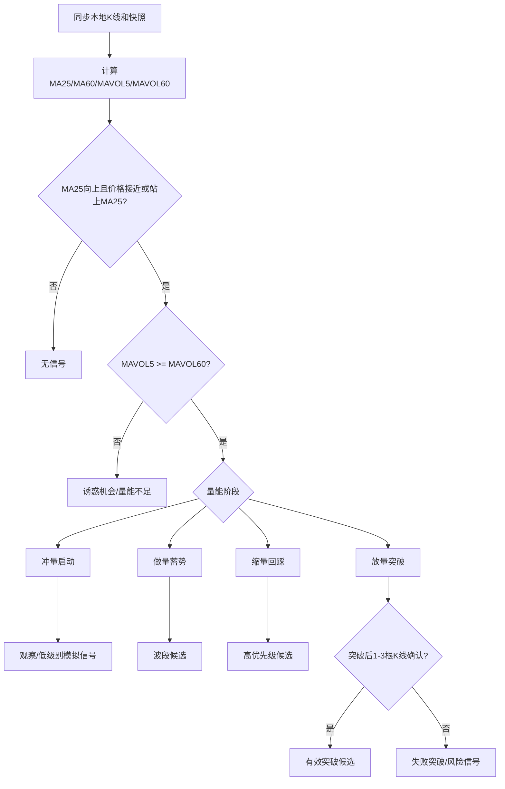

# 25/60 战法研究与量化落地方案

日期：2026-05-05

本文用于把公开资料中的 25/60 战法沉淀为本平台可回测、可解释、可部署、可监控的量化策略规格。本文不构成投资建议，所有阈值必须经过全市场历史回测、滚动验证、交易成本和成交约束校验后才能进入生产模拟。

## 1. 研究口径

### 1.1 资料来源

本次整理参考三类资料：

- 民间战法与指标公式资料：公开文章普遍把 2560 解释为 25 日均线、5 日均量线、60 日均量线的组合，并围绕冲量、做量、缩量展开。例如掌上指标文章说明 25 日均线向上、5 日均量与 60 日均量关系是核心条件；点掌财经也解释了冲量、做量、缩量的常见说法；好公式网把 25/60 进一步拆成趋势界定和动能确认。
- 技术分析基础资料：山东大学经济学院公开课程材料强调价格、成交量和时间是技术分析的重要变量，同时提醒技术指标存在局限，必须结合市场特性和其他指标交叉验证。
- 投资者行为与量化风险资料：深交所投资者调查显示，不少个人投资者依据价格走势和成交量等技术指标做决策，同时频繁交易、集中持股、追涨杀跌是亏损的重要行为偏差。时间序列动量研究也提示，中国市场短期动量和长期反转效应依赖观察期、持有期和样本特征。

参考链接：

- [掌上指标 2560 战法说明](https://www.6o7o.com/?id=7925)
- [点掌财经 2560 均量线实战用法](https://www.aniu.tv/gp_article_753787.shtml)
- [好公式网 2560 战法套装说明](https://www.goodgongshi.com/tongdaxingongshi/119011.html)
- [山东大学经济学院 市场指标分析法](https://www.econ.sdu.edu.cn/jrtzx/info/1448/25822.htm)
- [深交所 2016 年个人投资者状况调查报告发布](https://www.szse.cn/aboutus/trends/news/t20170316_518921.html)
- [Time series momentum and contrarian effects in the Chinese stock market](https://arxiv.org/abs/1702.07374)

### 1.2 多 agent 结论

投资研究 agent 结论：

- 25/60 没有统一官方定义，本质是一套价格趋势和成交量确认的经验规则。
- 原始民间口径的重点不是价格 MA60，而是 25 日均线和 60 日均量。
- 为了平台量化，必须把口号拆成趋势、量能、结构、确认、风控五层。

技术架构 agent 结论：

- 生产策略不能在运行时直接拉外部行情接口，必须先把 K 线、快照、同步状态落到本地 MySQL。
- Redis 只适合队列、短期缓存和幂等 key，MySQL 才是行情、信号、订单和持仓事实来源。
- mootdx 适合作为实时快照和未复权分钟线来源；前复权/后复权日线仍要用本地数据中心统一口径。

产品流程结论：

- 用户不能只看到“选中/未选中”，必须看到本次命中属于冲量、做量、缩量、放量突破、失败突破中的哪一种。
- 策略页面要支持编辑参数、测试样本、回测、部署、运行监控、模拟买卖和后续实盘预留。
- 数据中心页面要能回答每只证券同步到了什么周期、什么复权口径、截止到哪天、数据源是什么、是否有错误。

## 2. 战法精髓

25/60 战法的核心不是“股价碰 25 日线就买”，也不是“放量就买”。更准确的拆法是：

1. 25 日均线判断中期价格趋势。
2. 5 日均量线判断短期资金活跃度。
3. 60 日均量线判断资金活跃度基准。
4. 股价回踩或突破 25 日均线时，短期量能必须已经站上或接近 60 日均量。
5. 信号质量取决于量能所处阶段：冲量、做量、缩量、放量突破的含义不同。
6. 失败突破、巨量滞涨、跌破均线、样本不足、停牌和涨跌停不可成交必须进入风控。

本平台需要把它实现为“信号分层和评分系统”，而不是一个单一布尔选股条件。

## 3. 核心概念量化定义

以下符号默认基于日 K、前复权 `qfq`：

- `C`: 收盘价。
- `O/H/L`: 开盘价、最高价、最低价。
- `V`: 成交量。
- `A`: 成交额。
- `MA25`: `C` 的 25 日移动平均。
- `MA60`: `C` 的 60 日移动平均，原始 2560 不一定使用，但平台应作为趋势过滤和风控参考。
- `MAVOL5`: `V` 的 5 日移动平均。
- `MAVOL60`: `V` 的 60 日移动平均。
- `VR5_60`: `MAVOL5 / MAVOL60`。
- `VR1_60`: `V / MAVOL60`。
- `DIST25`: `(C - MA25) / MA25`。
- `HIGH20`: 过去 20 根 K 线最高价。

### 3.1 趋势层

基础趋势：

```text
trend_core =
  MA25_t > MA25_{t-5}
  AND C_t >= MA25_t * 0.985
```

增强趋势：

```text
trend_strong =
  trend_core
  AND C_t > MA60_t
  AND MA25_t >= MA60_t
```

说明：

- 原始战法强调 25 日均线向上或至少走平。
- 平台新增 MA60 是为了过滤中期弱势和识别趋势破坏，不应把它混同为原始口径。

### 3.2 量能层

基础量能：

```text
volume_base_ok = MAVOL5_t >= MAVOL60_t * 1.0
```

温和放量：

```text
volume_expand = VR1_60_t >= 1.3
```

强放量：

```text
volume_strong = VR1_60_t >= 1.5
```

异常巨量风险：

```text
volume_extreme_risk = VR1_60_t >= 3.0
```

说明：

- 原始 2560 的“量能达标”主要看 `MAVOL5 > MAVOL60`。
- 平台里的“放量”应额外看当日成交量相对 60 日均量的倍数，否则无法区分温和做量和单日爆量。

### 3.3 结构层

贴近 25 日均线：

```text
near_ma25 =
  L_t <= MA25_t * 1.03
  AND C_t >= MA25_t * 0.985
  AND abs(DIST25_t) <= 0.05
```

缩量回踩：

```text
pullback_shrink =
  trend_core
  AND near_ma25
  AND V_t <= MAVOL5_t
  AND VR1_60_t <= 1.0
```

平台突破：

```text
breakout_volume =
  trend_core
  AND C_t > HIGH20_{t-1} * 1.01
  AND VR1_60_t >= 1.3
  AND C_t >= H_t * 0.97
```

失败突破：

```text
failed_breakout =
  had_breakout_in_last_5_bars
  AND C_t < breakout_price * 0.99
```

## 4. 冲量、做量、缩量、放量的策略解释

### 4.1 冲量

战法语义：

- 股价在回踩或突破 25 日均线附近启动。
- `MAVOL5` 刚刚上穿 `MAVOL60`。
- 说明短期资金刚开始活跃，但形态未完全稳定。

量化定义：

```text
volume_impulse =
  cross_up(MAVOL5, MAVOL60, lookback=3)
  AND C_t >= MA25_t * 0.985
  AND trend_core
```

平台解释：

- 信号标签：`冲量启动`
- 信号级别：观察或低仓位模拟。
- 风险：容易是假突破或短线资金脉冲，需要后续 1-3 根 K 线确认。

### 4.2 做量

战法语义：

- 前一波 `MAVOL5` 曾上到 `MAVOL60` 附近或上方。
- 之后成交量回落但没有彻底冷却。
- 股价仍能守住 25 日均线，代表资金在“做量”和稳定筹码。

量化定义：

```text
volume_build =
  max(VR5_60 over last 20 bars) >= 1.05
  AND VR5_60_t BETWEEN 0.85 AND 1.25
  AND C_t >= MA25_t * 0.985
  AND MA25_t > MA25_{t-5}
```

增强条件：

```text
build_quality =
  up_day_volume_sum_10 / down_day_volume_sum_10 >= 1.2
  AND close_center_10 > close_center_20
```

平台解释：

- 信号标签：`做量蓄势`
- 信号级别：波段候选。
- 风险：如果量能回落到 `MAVOL60` 下方并且价格跌破 MA25，则做量失败。

### 4.3 缩量或锁量

战法语义：

- `MAVOL5` 已在 `MAVOL60` 上方运行一段时间。
- 近 1-2 天出现阶段性低量。
- 股价回踩 25 日均线但不破或快速收回，说明抛压收敛。

量化定义：

```text
volume_lock_shrink =
  count(VR5_60 >= 1.0 over last 10 bars) >= 5
  AND V_t <= min(V over last 5 bars) * 1.05
  AND near_ma25
  AND C_t >= MA25_t
```

平台解释：

- 信号标签：`缩量回踩`
- 信号级别：高优先级观察或模拟买入候选。
- 风险：公开资料常把它说成高质量机会，但这必须由平台回测验证，不能直接按经验入场。

### 4.4 放量

战法语义：

- 当日成交量显著高于中长期量能基准。
- 如果价格突破平台，可能是有效突破。
- 如果价格滞涨或长上影，可能是派发或失败突破。

量化定义：

```text
volume_expand = VR1_60_t >= 1.3
volume_strong = VR1_60_t >= 1.5
volume_extreme = VR1_60_t >= 3.0
```

平台解释：

- 信号标签：`放量突破`、`放量滞涨`、`异常巨量`
- 信号级别：只有价格结构配合时才加分。
- 风险：单日巨量不能自动判定为强势，需要结合收盘位置、突破位、次日确认。

## 5. 平台策略状态机



## 6. 统一信号输出合同

所有扫描、回测、生产运行、模拟买卖都应使用统一 schema：

```json
{
  "schema_version": "strategy-signal/2560/v1",
  "strategy_code": "2560",
  "symbol": "000001",
  "name": "平安银行",
  "security_type": "stock",
  "bar_interval": "1d",
  "adjust": "qfq",
  "signal_date": "2026-05-05",
  "signal_type": "WATCH",
  "signal_subtype": "volume_lock_shrink",
  "score": 86,
  "price_ref": 12.34,
  "indicators": {
    "ma25": 12.1,
    "ma60": 11.8,
    "ma25_slope_5": 0.025,
    "ma60_slope_10": 0.011,
    "mavol5": 1200000,
    "mavol60": 900000,
    "vr5_60": 1.33,
    "vr1_60": 0.82,
    "dist25": 0.012,
    "high20": 13.2,
    "turnover_rate": 2.1,
    "amount": 350000000
  },
  "phase": {
    "volume_phase": "shrink_after_build",
    "pullback_count_60": 1,
    "setup_age": 8,
    "breakout_confirmed": false,
    "failed_breakout": false
  },
  "risk": {
    "risk_score": 32,
    "risk_level": "low",
    "risk_flags": []
  },
  "data": {
    "source": "local:mysql",
    "provider": "akshare",
    "data_quality": "primary",
    "fallback_used": false,
    "bar_count": 180,
    "latest_bar_time": "2026-05-05"
  },
  "reason": "MA25上行，MAVOL5高于MAVOL60，近两日缩量回踩MA25且未跌破。"
}
```

## 7. 评分模型

总分 100：

- 趋势 30 分：MA25 上行、MA60 过滤、MA25 与 MA60 多头结构。
- 量能 25 分：MAVOL5/MAVOL60、当日量能、冲量/做量/缩量阶段。
- 形态 20 分：贴近 MA25、第一次回踩、突破位、收盘位置。
- 流动性 10 分：成交额、换手率、停牌/新股/涨跌停可交易性。
- 风险 10 分：乖离率、波动率、连续涨幅、巨量滞涨、失败突破。
- 数据质量 5 分：本地数据完整度、复权口径、是否 fallback/mock。

建议门槛：

- `score >= 85`: 高优先级候选，可进入模拟买入评估。
- `70 <= score < 85`: 观察候选。
- `55 <= score < 70`: 低置信度，仅用于研究。
- `< 55`: 不展示或作为被过滤样本。

## 8. 回测与模拟交易规则

### 8.1 回测

必须遵守：

- 只读本地 MySQL K 线。
- 每个信号日只能使用当日及之前数据，不能偷看未来。
- 日 K 策略默认按 T+1 开盘或可成交价模拟，不使用信号日收盘直接成交。
- 计入手续费、印花税、滑点、涨跌停不可成交、停牌、最小交易单位。
- 输出胜率、收益、最大回撤、盈亏比、交易分布、持仓天数分布、信号子类型归因。

### 8.2 模拟买入和卖出

买入触发：

```text
paper_buy_intent =
  score >= configured_threshold
  AND signal_subtype IN ["volume_lock_shrink", "volume_build", "breakout_volume"]
  AND no_active_position(symbol)
  AND data_quality == "primary"
```

卖出或风控触发：

```text
paper_exit_intent =
  C_t < MA25_t * 0.98
  OR C_t < MA60_t * 0.98
  OR failed_breakout
  OR holding_days >= max_holding_days
  OR stop_loss_hit
  OR take_profit_hit
```

后续实盘预留：

- 保留 `BrokerAdapter` 抽象，只提交订单意图，不直接真实下单。
- 增加人工确认、全局 kill switch、账户资金对账、订单回报对账、撤单和异常补偿。
- 生产实盘必须和模拟账户隔离，凭证单独加密存储。

## 9. 数据中心与同步方案

### 9.1 数据口径

日线 2560 主策略：

- `security_type`: `stock`，后续支持 `etf`、`index`、`bond`、`convertible_bond`。
- `bar_interval`: `1d`。
- `adjust`: `qfq`。
- 最低有效样本：65 根 K 线。
- 推荐初始化：240 自然日或更长，保证停牌和节假日后仍有足够交易日。

可转债策略：

- `security_type`: `convertible_bond`。
- `bar_interval`: `15m` 或 `30m`。
- `adjust`: `none`。
- 规则不同于股票，因为可转债支持 T+0，应单独定义策略模板，不能直接复用股票 T+1 风控。

### 9.2 同步流程

初始化：

```text
stocks sync
  -> full-market daily qfq bootstrap
  -> optional daily none bootstrap
  -> optional 15m/30m bootstrap for deployed universes
  -> latest snapshot sync
```

增量：

```text
sync state cursor
  -> coverage_end_date - correction_window
  -> provider fetch
  -> upsert bars
  -> update coverage and last_success_trade_date
  -> write sync run audit
```

复权修复：

- 每周重刷近 180-240 天 `qfq` 日线。
- 分红送转后必须扩大修复窗口。
- 分时和快照统一使用不复权口径，和 qfq 日线做展示时必须标明口径差异。

### 9.3 缓存与效率

全市场 5000 多只证券做 25/60 计算，不能每次策略运行都逐只外部拉取。

建议：

- MySQL 保存原始 K 线和最新快照。
- 增加 `stock_indicator_bars` 或等价缓存表，保存 `MA25/MA60/MAVOL5/MAVOL60/VR/DIST/HIGH20/ATR` 等派生指标。
- 日线收盘后批量计算全市场指标，策略运行读取最新指标快照。
- Redis 缓存最近一批全市场指标切片，TTL 1-5 分钟，用于页面和 worker 加速。
- 策略生产运行按证券类型、周期、复权口径分批，避免一次任务扫描所有数据。

## 10. 当前项目差距

基于当前代码和文档，主要差距如下：

- `backend/strategies/strategy_2560.py` 当前只计算 `ma25`、`ma5_vol`、`ma60_vol`、`vol_ratio`，没有价格 `MA60`。
- 当前信号只有缩量回踩、放量突破、温和突破，缺少冲量、做量、缩量锁量、失败突破、量能阶段。
- 当前策略输出没有统一 `strategy-signal/2560/v1` 合同，回测、扫描、模拟交易对字段解释不够统一。
- 当前策略文件存在编码乱码，中文展示、日志和内部字段混在一起，后续维护风险高。
- `bar_interval` 已进入部分 API 和数据链路，但 2560 策略本身仍以日线为主，没有真正按周期抽象。
- 数据中心已具备覆盖率和同步状态方向，但策略说明页还没有把“本股票本周期数据截止到哪天”直接挂到信号解释里。
- 生产 local-only 已有方向，但内置策略仍保留 provider/mock fallback，生产运行要彻底禁止静默 mock。

## 11. 优化落地清单

### P0: 策略语义补齐

- [x] 重写 `backend/strategies/strategy_2560.py` 为 UTF-8，可读中文说明，内部字段使用英文稳定 key。
- [x] 增加价格 `MA60`、`MA25` 斜率、`MA60` 斜率、`HIGH20`、当日量比、成交额均线、乖离率。
- [x] 增加 `volume_phase`: `insufficient`、`impulse`、`build`、`lock_shrink`、`breakout_expand`、`extreme_risk`。
- [x] 增加 `signal_subtype`: `volume_impulse`、`volume_build`、`volume_lock_shrink`、`breakout_volume`、`failed_breakout`。
- [x] 输出统一 `strategy-signal/2560/v1`。
- [x] 为每个信号输出中文解释和可追溯指标。

### P1: 数据中心强绑定

- [x] 生产策略运行强制 `local_only=true`。
- [x] 缺历史 K 线返回 `blocked_no_history`，缺实时快照返回 `blocked_no_snapshot`。
- [x] 策略结果展示 `bar_interval`、`adjust`、`latest_bar_time`、`data_quality`、`fallback_used`。
- [x] 增加全市场指标预计算表或缓存层。
- [x] 增加 qfq 周期性修复任务。

### P2: 回测增强

- [x] 回测按信号子类型归因：冲量、做量、缩量、放量突破、失败突破。
- [x] 输出最大回撤、收益曲线、交易分布、持仓天数分布、胜率、盈亏比。
- [x] 支持交易成本、滑点、涨跌停不可成交、T+1。
- [x] 禁止回测直接调用外部 provider。

### P3: 模拟交易闭环

- [x] 信号达到阈值自动生成模拟买入意图。
- [x] 持仓每日根据 MA25/MA60、失败突破、止盈止损、最大持有天数生成卖出意图。
- [x] 订单、成交、持仓、现金、PnL 全部落 MySQL。
- [x] 保留实盘 adapter，但默认禁用真实下单。

### P4: 前端产品化

- [x] 策略页增加 25/60 参数编辑器和代码编辑器。
- [x] 信号结果用中文展示 `冲量`、`做量`、`缩量回踩`、`放量突破`、`失败突破` 标签。
- [x] 每个标签提供可展开解释：为什么命中，哪些指标支撑，哪些风险扣分。
- [x] 数据中心页面按证券类型、周期、复权口径展示覆盖率和截止日期。
- [x] K 线页叠加 MA25、MA60、MAVOL5、MAVOL60、信号点、模拟买卖点。

## 12. 生产原则

1. 外部行情接口只服务同步任务，不服务生产策略逻辑。
2. 策略只读本地 MySQL 和受控缓存。
3. 所有信号必须带数据口径和解释。
4. 所有模拟交易必须可审计、可回放、可归因。
5. 25/60 是研究策略，不是收益承诺；上线前必须用全样本回测和样本外验证。
