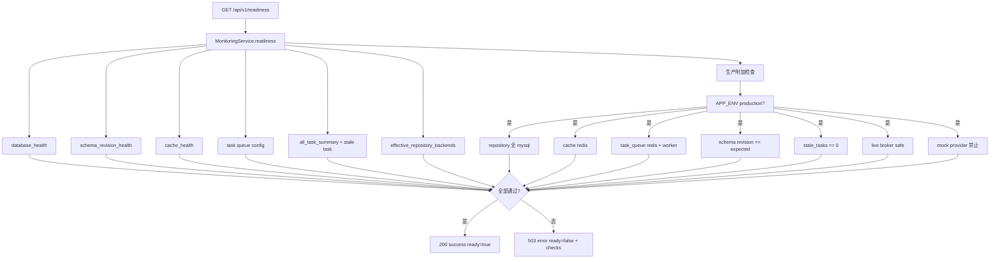
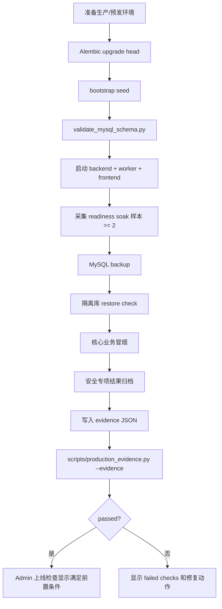
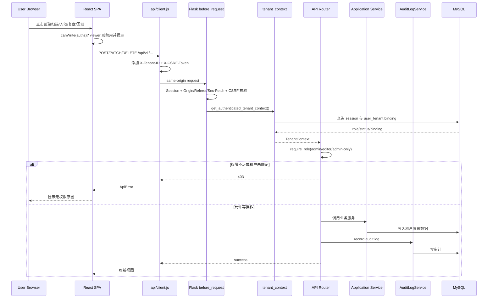
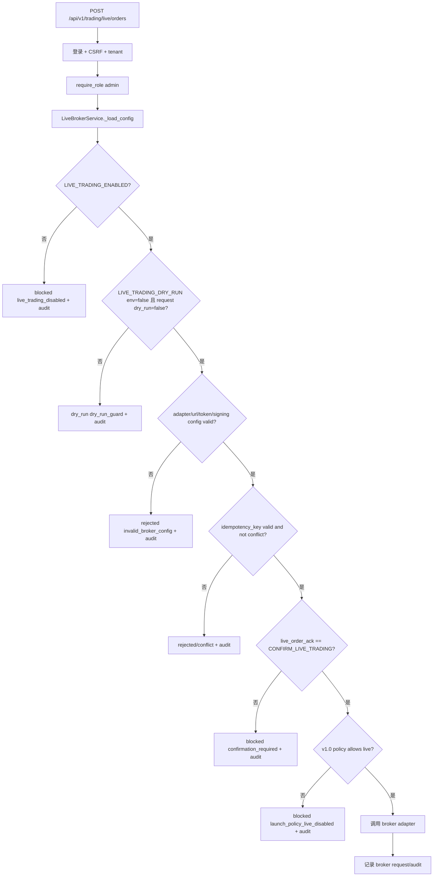
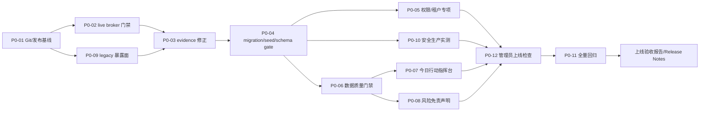

# AiStocks 上线改造架构设计与详细实施计划

> 文档角色：高见远（Gao）· 架构师  
> 工作范围：基于现状分析、上线改进 PRD 与关键代码抽查，制定上线版 v1.0 架构设计和实施计划  
> 约束：本文只做设计/计划，不修改业务代码  
> 生成日期：2026-05-08

## 1. 阅读与代码抽查结论

### 1.1 输入文档

- `docs/software-company/aistocks-analysis.md`
- `docs/software-company/aistocks-improvement-prd.md`

两份文档已经明确：本轮目标不是继续扩展完整量化平台，而是把现有系统收敛为 **AiStocks 内部投研工作台上线版 v1.0**，达到“可上线、可证明、可回滚、可持续运维”。

### 1.2 关键代码/配置抽查

本次抽查的关键文件包括：

- 应用工厂与安全基线：`backend/__init__.py`
- v1 API 注册与 readiness：`backend/api_v1/blueprint.py`
- 监控与 readiness 服务：`backend/application/monitoring_service.py`
- 生产配置校验：`backend/core/config.py`
- 租户上下文与权限：`backend/core/tenant_context.py`
- 扫描/选股池写操作：`backend/api_v1/routers/scans.py`、`backend/api_v1/routers/picks.py`
- live broker 边界：`backend/api_v1/routers/trading.py`、`backend/application/live_broker_service.py`
- production evidence：`scripts/production_evidence.py`、`tests/test_production_evidence.py`
- deploy preflight：`scripts/deploy_preflight.py`、`tests/test_deploy_preflight.py`
- schema validator：`scripts/validate_mysql_schema.py`
- 前端 API client 与权限透传：`frontend/src/api/client.js`
- 前端主路由与导航：`frontend/src/app/App.jsx`
- 今日看板、监控、模拟交易、后台管理：`frontend/src/pages/DashboardPage.jsx`、`frontend/src/pages/MonitoringPage.jsx`、`frontend/src/pages/PaperTradingPage.jsx`、`frontend/src/pages/AdminPage.jsx`
- 权限 E2E：`frontend/e2e/permissions.spec.js`
- 部署配置：`.env.example`、`docker-compose.yml`、`package.json`

### 1.3 已具备的上线基础

1. **React + `/api/v1` 主线已形成**：v1 API 覆盖 auth、admin、market、monitoring、picks、reports、scans、settings、strategies、sync、tasks、trading。
2. **权限与租户基础已存在**：v1 主路径使用 `get_authenticated_tenant_context()`，并通过 `require_role()` 控制写操作。
3. **CSRF/Origin/Sec-Fetch 安全基线已起步**：写操作有 CSRF token 与跨站来源检查。
4. **readiness 已覆盖核心依赖**：数据库、schema revision、cache、task queue、stale task、repository backend 已纳入检查。
5. **生产配置校验已有 fail-closed 思路**：生产环境禁止弱 `SECRET_KEY`、mock provider、非 Redis cache/task queue、SQLite repository backend。
6. **live broker 已有多层防护**：默认 disabled、dry-run、admin-only、二次确认、idempotency、审计。
7. **部署形态基本完整**：Docker Compose 包含 MySQL、Redis、backend、worker、frontend。
8. **测试资产较丰富**：pytest、Playwright E2E、preflight、production evidence、tenant/permission/live broker 相关测试均已有基础。

### 1.4 上线阻断与需修复的架构缺口

| 缺口 | 说明 | 优先级 |
| --- | --- | --- |
| Git 发布基线异常 | `git status --short` 显示大量 `2560_strategy/...` 删除与根目录同名文件未跟踪，发布不可证明 | P0 |
| production evidence revision 口径不一致 | `MonitoringService` 期望 `0022_stock_daily_bar_timestamps`，但 `scripts/production_evidence.py` 仍校验 `0011_user_engagement_fields` | P0 |
| production evidence repository key 不完整 | evidence/preflight 的 repository key 列表与当前 `TRADING_REPOSITORY_BACKEND` 等配置未完全一致 | P0 |
| Compose 启动门禁不完整 | 目前依赖 healthcheck/readiness，但 Alembic upgrade、seed、schema validate 的启动顺序没有固化为迁移/seed gate 服务 | P0 |
| backend service healthcheck 需复核 | `frontend` 依赖 backend `service_healthy`，需要确保 backend compose 层 healthcheck 明确存在且使用 `/api/v1/readiness` | P0 |
| 首页仍是聚合看板 | 尚未达到“今日行动指挥台”：缺生产证据、上线门禁、待办阻断原因、admin-only 上线检查入口 | P0 |
| 管理员上线检查入口缺失 | Monitoring/Admin 当前未集中展示 P0 门禁、evidence、preflight、legacy/live broker 风险 | P0 |
| 风险免责声明覆盖不足 | 模拟交易页有“实盘接口预留未启用”，但登录、首页、扫描、回测、报表、导出等仍需统一文案 | P0 |
| 数据质量门禁未统一成服务 | health 与页面提示存在，但扫描、入池、回测、paper trading 的阻断/确认规则未统一 | P0 |
| legacy 暴露面仍需清单化 | backend 仍注册 legacy blueprint，frontend nginx 冻结旧 `/api`，但保留页面/写入口需要上线检查清单 | P0 |
| package scripts 偏 Windows venv | 根 `package.json` 使用 `venv\\Scripts\\python.exe`，CI/容器可移植性需收敛 | P0/P1 |

## 2. 改造原则与上线架构目标

### 2.1 改造原则

1. **上线边界先行**  
   v1.0 只交付内部投研工作台：登录/租户/权限、今日行动指挥台、市场发现 MVP、策略扫描、选股池、K 线、复盘、回测、报表、模拟验证、监控、管理员上线检查。不开放实盘自动交易。

2. **生产环境 fail-closed**  
   生产配置、schema、repository backend、Redis、worker、数据源、live broker、production evidence 任一关键项失败时，不允许以“降级可用”方式宣称上线。

3. **所有结论带证据**  
   扫描、入池、K 线、回测、报表、模拟验证必须展示 provider、actual_provider、data_quality、fallback_used、coverage/更新时间与风险声明。

4. **写操作必须双层权限**  
   前端禁用只是体验，后端必须拒绝 viewer 写操作、非绑定租户访问、跨站写请求、缺 CSRF 写请求。

5. **live broker 默认不可误触发**  
   v1.0 中 live broker 不作为用户功能开放。API 默认 disabled + dry-run；UI 不展示实盘下单入口；上线检查必须确认配置安全。

6. **主路径只走 React + `/api/v1`**  
   legacy 页面和旧 `/api` 只允许跳转、只读、410 或 admin-only 维护入口，不承接新增业务。

7. **先收敛可证明性，再做体验增强**  
   Git 基线、证据、启动门禁、安全专项优先于 UI 优化；P1/P2 不阻塞 v1.0。

8. **不在本轮过度重构**  
   不引入大型框架替换，不重写任务系统，不删除全部 SQLite/legacy，除非 production evidence passed 且另起退役任务。

### 2.2 上线架构目标

v1.0 目标架构：

- 前端：React SPA，经 frontend/Nginx 暴露，用户主入口统一进入 `/app` 或 SPA fallback。
- API：Flask `/api/v1` 提供所有上线主流程接口。
- 安全：Session + CSRF + Origin/Sec-Fetch + RBAC + tenant binding + audit log。
- 数据：生产主路径 MySQL；SQLite 仅作为开发/legacy 过渡能力，不参与生产主流程。
- 缓存/任务：生产 Redis cache + Redis task queue + standalone worker。
- 行情：mootdx primary + akshare fallback；生产禁止 mock；fallback/coverage 风险可见且可门禁。
- 运维：readiness + monitoring + deploy preflight + production evidence + backup/restore/runbook + admin launch check。
- 交易边界：paper trading 可作为模拟验证；live broker 默认隐藏/禁用/强审计。

## 3. 目标模块架构图

```mermaid
flowchart TB
  User[内部用户\nadmin/editor/viewer] --> Gateway[Frontend Gateway\nNginx + React SPA]
  Gateway -->|same-origin /api/v1| API[Flask API v1]

  subgraph Frontend[frontend/src]
    App[App.jsx 路由与权限壳]
    Dashboard[今日行动指挥台]
    Discovery[市场发现 MVP]
    Scans[策略扫描]
    Picks[选股池/复盘]
    Kline[K 线/标的上下文]
    Strategies[策略/回测]
    Reports[研究报表]
    Paper[模拟验证]
    Monitoring[生产监控]
    Admin[后台/上线检查]
    Client[api/client.js\nTenant + CSRF]
  end

  Gateway --> App
  App --> Dashboard
  App --> Discovery
  App --> Scans
  App --> Picks
  App --> Kline
  App --> Strategies
  App --> Reports
  App --> Paper
  App --> Monitoring
  App --> Admin
  App --> Client

  subgraph Backend[backend]
    Security[安全基线\nSession/CSRF/Origin/CORS/Security Headers]
    Tenant[tenant_context\n登录 + X-Tenant-ID + role]
    Routers[api_v1 routers]
    Services[application services]
    DataQuality[DataQualityGateService\n新增/收敛]
    LaunchCheck[LaunchCheckService\n新增]
    Repos[repositories\nMySQL 主路径]
    MarketProvider[market_data provider\nmootdx -> akshare]
    TaskQueue[Redis task queue]
    Worker[standalone worker]
    BrokerGate[LiveBrokerGate\ndisabled/dry-run/admin/audit]
    Audit[AuditLogService]
  end

  API --> Security --> Tenant --> Routers --> Services
  Services --> DataQuality
  Services --> Repos --> MySQL[(MySQL 8.4)]
  Services --> MarketProvider
  Services --> TaskQueue --> Redis[(Redis 7)]
  Worker --> TaskQueue
  Worker --> Services
  Services --> BrokerGate
  Services --> Audit --> MySQL
  LaunchCheck --> MySQL
  LaunchCheck --> Redis
  LaunchCheck --> TaskQueue
  LaunchCheck --> DataQuality
  LaunchCheck --> BrokerGate
  LaunchCheck --> Evidence[production evidence JSON]
  LaunchCheck --> Preflight[deploy preflight/repo hygiene]

  subgraph Ops[上线证据与运维]
    Alembic[Alembic upgrade]
    Seed[bootstrap seed]
    SchemaValidate[validate_mysql_schema]
    Readiness[/api/v1/readiness]
    ProdEvidence[scripts/production_evidence.py]
    Backup[backup/restore drill]
  end

  Alembic --> MySQL
  Seed --> MySQL
  SchemaValidate --> MySQL
  Readiness --> LaunchCheck
  ProdEvidence --> Evidence
  Backup --> Evidence
```

## 4. 关键流程设计

### 4.1 Readiness 流程

目标：让 `/api/v1/readiness` 成为生产可用性硬门禁，不只是健康提示。



本轮建议在现有 `MonitoringService.readiness()` 基础上新增/补齐：

- `checks.live_broker_gate`
- `checks.market_data_provider`
- `checks.seed_baseline`
- `checks.production_evidence_core` 可只在 admin 上线检查中强制，不建议普通 readiness 读取本地敏感路径；如读取，只返回布尔与摘要，不暴露密钥或绝对路径。

### 4.2 Production evidence 流程

目标：把 production evidence 从“SQLite 退役证明”升级为“v1.0 上线证明”。



必须修正的口径：

- `scripts/production_evidence.py` 的 expected Alembic revision 应与 `backend/application/monitoring_service.py` 和当前 `alembic/versions` 对齐，当前应为 `0022_stock_daily_bar_timestamps`。
- production evidence 的 repository backend keys 应与 `backend/core/config.py` 的 `REPOSITORY_BACKEND_ENV_VARS` 对齐，包括 `TRADING_REPOSITORY_BACKEND`。
- evidence schema 建议升级到 `production-evidence/v1.0` 或在 v1 中增加 `release_gate` 分组，避免继续只表达 SQLite retirement。

### 4.3 权限写操作流程

目标：viewer 写操作前端禁用，后端仍必须拒绝；非绑定租户必须 403；所有写操作审计。



### 4.4 Live broker gate 流程

目标：v1.0 默认不开放实盘交易；即使 API 被调用，也不能误触发真实交易。



本轮建议增加一个更高层的 **v1.0 launch policy gate**：即使环境变量被错误打开，v1.0 生产策略仍默认 `LIVE_BROKER_LAUNCH_POLICY=disabled`，管理员上线检查必须显示 safe。只有未来另行合规审批后才允许改为 `admin_guarded` 或 `enabled`。

## 5. 需要修改/新增的文件列表

> 以下是实施计划中的建议文件清单，不代表本文已修改这些业务文件。

### 5.1 P0 必改/新增

| 文件 | 类型 | 目的 |
| --- | --- | --- |
| `scripts/production_evidence.py` | 修改 | 对齐 expected Alembic revision；补齐 repository backend keys；扩展 v1.0 上线 evidence schema |
| `tests/test_production_evidence.py` | 修改 | 覆盖 revision=0022、TRADING repository backend、上线 evidence failed/passed |
| `backend/application/monitoring_service.py` | 修改 | readiness 增加 live broker safe、market provider、seed/schema gate 摘要；统一 checks 字段 |
| `backend/application/launch_check_service.py` | 新增 | 聚合 P0 上线检查：readiness、preflight/evidence 摘要、live broker、legacy、data quality、测试证据 |
| `backend/api_v1/routers/admin.py` 或 `backend/api_v1/routers/monitoring.py` | 修改 | 新增 admin-only `/admin/launch-check` 或 `/monitoring/launch-check` |
| `frontend/src/api/client.js` | 修改 | 增加 `adminLaunchCheck()` / `monitoringLaunchCheck()`、`readiness()`、`liveBrokerStatus()` 如需展示 |
| `frontend/src/pages/MonitoringPage.jsx` | 修改 | 增加“上线门禁”tab/section，展示 P0 状态和失败原因 |
| `frontend/src/pages/AdminPage.jsx` | 修改 | 可选：增加上线检查入口卡片；或保持入口在 MonitoringPage |
| `frontend/src/pages/DashboardPage.jsx` | 修改 | 升级为今日行动指挥台，展示 readiness、数据质量、待复盘、失败任务、上线状态、免责声明 |
| `frontend/src/app/App.jsx` | 修改 | 导航顺序调整；模拟交易降级；上线检查入口 admin-only |
| `frontend/src/components/common/RiskDisclaimer.jsx` | 新增 | 统一风险/非投资建议文案组件 |
| `frontend/src/components/common/DataQualityBadge.jsx` | 新增 | 统一 primary/fallback/unknown/mock 展示 |
| `frontend/src/pages/ScansPage.jsx` | 修改 | 扫描创建/结果区展示数据质量门禁和风险声明；viewer 禁用说明 |
| `frontend/src/pages/StrategiesPage.jsx` | 修改 | 回测结果展示“历史回测不代表未来收益”和数据质量 |
| `frontend/src/pages/ReportsPage.jsx` | 修改 | 页面和导出包含免责声明、fallback/unknown 区分 |
| `frontend/src/pages/PaperTradingPage.jsx` | 修改 | 强化“模拟交易不代表真实成交”；隐藏/只读 live broker 状态 |
| `frontend/src/pages/StockKlinePage.jsx` | 修改 | K 线页展示 provider、actual_provider、data_quality、fallback_used |
| `backend/application/data_quality_gate_service.py` | 新增 | 统一扫描/入池/回测/paper trading 的数据质量判断规则 |
| `backend/api_v1/routers/scans.py` | 修改 | 创建扫描前调用数据质量门禁或记录 gate_result |
| `backend/api_v1/routers/picks.py` | 修改 | 入池/复盘时记录数据质量与必要二次确认 |
| `backend/api_v1/routers/strategies.py` | 修改 | 回测前后纳入 data quality gate 与假设说明 |
| `backend/api_v1/routers/trading.py` | 修改 | live broker status admin-only；v1.0 policy disabled；paper 写操作纳入数据质量门禁 |
| `backend/core/config.py` | 修改 | 增加上线 policy 配置项与生产校验：`LIVE_BROKER_LAUNCH_POLICY`、data quality thresholds、evidence path |
| `.env.example` | 修改 | 增加 v1.0 上线 policy、data quality threshold、evidence path 注释；保留 live disabled/dry-run 默认 |
| `docker-compose.yml` | 修改 | 增加 migration/seed/schema-gate 服务或固化启动命令；补齐 backend healthcheck；frontend/worker depends_on gate |
| `scripts/deploy_preflight.py` | 修改 | 检查 migration/seed/schema gate、backend healthcheck、live broker policy、evidence revision/key 对齐 |
| `tests/test_deploy_preflight.py` | 修改 | 覆盖新增 preflight checks |
| `tests/test_api_v1.py` / `tests/test_api_v1_e2e.py` | 修改 | 覆盖 readiness、launch-check、data quality、viewer writes |
| `tests/test_live_broker_service.py` | 修改 | 增加 v1.0 launch policy disabled 场景 |
| `tests/test_tenant_repository.py` / 新增 `tests/test_permissions_security.py` | 修改/新增 | 覆盖 tenant IDOR、viewer 写拒绝、legacy 保留入口 |
| `frontend/e2e/permissions.spec.js` | 修改 | 增加 viewer 写操作矩阵 |
| `frontend/e2e/workflow-closure.spec.js` | 修改 | 增加端到端上线闭环、免责声明、数据质量状态 |
| `frontend/e2e/monitoring.spec.js` 或 `admin.spec.js` | 新增/修改 | 覆盖管理员上线检查入口 |
| `package.json` | 修改 | 增加跨平台脚本或 npm 脚本包装，避免仅依赖 `venv\\Scripts` |

### 5.2 文档与证据文件

| 文件 | 类型 | 目的 |
| --- | --- | --- |
| `docs/product/PRODUCTION_EVIDENCE.md` | 修改 | 更新 v1.0 上线 evidence schema 与采集步骤 |
| `docs/product/PRODUCTION_EVIDENCE.example.json` | 修改 | 对齐新 schema、revision=0022、完整 repository backend keys |
| `docs/refactor/PRODUCTION_DEPLOY_RUNBOOK.md` | 修改 | 固化迁移/seed/schema gate、readiness、evidence、回滚流程 |
| `docs/product/LEGACY_ADMIN_POLICY.md` | 修改 | 更新 legacy 保留清单、风险等级、上线检查映射 |
| `docs/product/RELEASE_NOTES.md` | 修改 | 记录 v1.0 上线边界、禁用项、风险声明 |
| `docs/software-company/aistocks-architecture-plan.md` | 新增 | 本文档 |

### 5.3 暂不建议本轮删除的文件/能力

- 不建议本轮直接删除全部 `backend/routes/*`、`backend/pages/*`、`templates/*`。
- 不建议本轮直接删除 SQLite 兼容分支。
- 不建议本轮替换任务队列为 Celery/RQ。
- 不建议本轮引入完整 OpenAPI/BI/量化 IDE。

这些放入 P1/P2 或 production evidence passed 后的退役任务。

## 6. API / 数据结构 / 配置项设计

### 6.1 Readiness API 扩展

现有：

- `GET /api/v1/readiness`

建议响应结构保持兼容，新增字段：

```json
{
  "ready": false,
  "environment": "production",
  "database": { "ok": true, "dialect": "mysql" },
  "schema_revision": {
    "ok": true,
    "revision": "0022_stock_daily_bar_timestamps",
    "expected_revision": "0022_stock_daily_bar_timestamps"
  },
  "cache": { "ok": true, "backend": "redis" },
  "task_queue": { "backend": "redis", "execution_mode": "worker" },
  "tasks": { "stale": 0, "failed": 0, "running_or_queued": 0 },
  "repository_backends": {
    "PICKS_REPOSITORY_BACKEND": "mysql",
    "AUTH_REPOSITORY_BACKEND": "mysql",
    "AUDIT_REPOSITORY_BACKEND": "mysql",
    "SETTINGS_REPOSITORY_BACKEND": "mysql",
    "LOGS_REPOSITORY_BACKEND": "mysql",
    "STRATEGY_POOL_REPOSITORY_BACKEND": "mysql",
    "STRATEGY_REPOSITORY_BACKEND": "mysql",
    "TRADING_REPOSITORY_BACKEND": "mysql"
  },
  "market_data_gate": {
    "ok": true,
    "provider": "mootdx",
    "actual_provider": "mootdx",
    "data_quality": "primary",
    "fallback_used": false
  },
  "live_broker_gate": {
    "ok": true,
    "enabled": false,
    "dry_run": true,
    "adapter": "disabled",
    "launch_policy": "disabled"
  },
  "seed_baseline": {
    "ok": true,
    "default_tenant": true,
    "default_admin": true,
    "default_strategies": true
  },
  "checks": {
    "database": true,
    "schema_revision": true,
    "cache": true,
    "task_queue": true,
    "tasks": true,
    "repository_backends": true,
    "market_data_provider": true,
    "live_broker_gate": true,
    "seed_baseline": true
  }
}
```

### 6.2 Admin Launch Check API

建议新增：

- `GET /api/v1/admin/launch-check`，仅 admin。

职责：聚合 P0 上线门禁，不执行危险写操作，不暴露密钥。

响应结构：

```json
{
  "schema_version": "launch-check/v1",
  "overall_status": "blocked",
  "summary": "不可上线：production evidence failed, git baseline dirty",
  "generated_at": "2026-05-08T10:00:00+08:00",
  "items": [
    {
      "id": "P0-01",
      "name": "Git 仓库与发布基线收敛",
      "status": "failed",
      "severity": "blocker",
      "source": "repo_hygiene/preflight",
      "evidence": "git status shows path migration disorder",
      "next_action": "先执行 repo:clean-index 或手工确认迁移基线"
    },
    {
      "id": "P0-03",
      "name": "Production evidence 闭环",
      "status": "missing",
      "severity": "blocker",
      "source": "scripts/production_evidence.py",
      "evidence": "未找到 passed evidence 文件或校验失败",
      "next_action": "采集 MySQL backup/restore/readiness soak 后重新校验"
    }
  ],
  "readiness": { "ready": false, "checks": {} },
  "live_broker": { "safe": true, "enabled": false, "dry_run": true, "policy": "disabled" },
  "legacy": {
    "status": "warning",
    "items": [
      { "path": "/api", "policy": "410 by nginx", "risk": "low" },
      { "path": "/admin/backups", "policy": "admin-only", "risk": "medium" }
    ]
  },
  "evidence_paths": {
    "production_evidence": "docs/product/PRODUCTION_EVIDENCE.example.json",
    "preflight": "artifacts/preflight/latest.json",
    "test_report": "artifacts/test/latest.json"
  }
}
```

状态枚举：

- `passed`：满足上线前置条件。
- `warning`：内部试运行可接受，但不建议正式上线。
- `failed`：有明确失败。
- `missing`：证据缺失。
- `blocked`：存在 P0 blocker。

### 6.3 Data Quality Gate API/结构

建议先作为后端 service，而不是单独开放复杂 API。

核心结构：

```json
{
  "schema_version": "data-quality-gate/v1",
  "scope": "scan|pick|backtest|report|paper_trading|kline",
  "decision": "allow|warn|confirm_required|block",
  "data_quality": "primary|fallback|unknown|mock",
  "provider": "mootdx",
  "actual_provider": "akshare",
  "fallback_used": true,
  "coverage_ratio": 0.82,
  "staleness_seconds": 900,
  "reasons": ["fallback_used", "coverage_below_threshold"],
  "required_ack": "ACK_DATA_QUALITY_RISK"
}
```

建议默认规则：

| 场景 | primary | fallback | unknown | mock |
| --- | --- | --- | --- | --- |
| 首页展示 | allow | warn | warn | block in production |
| 创建扫描 | allow | confirm_required 或 block | confirm_required | block |
| 扫描结果入池 | allow | confirm_required | confirm_required | block |
| 回测 | allow | confirm_required，并在结果标注 | confirm_required | block |
| 报表 | allow | warn，可剔除/分组 | warn，可剔除/分组 | block |
| paper trading evaluate | allow | confirm_required | block | block |
| live broker | v1.0 全部 blocked | v1.0 全部 blocked | v1.0 全部 blocked | block |

阈值配置：

```env
DATA_QUALITY_MIN_COVERAGE_RATIO=0.95
DATA_QUALITY_MAX_STALENESS_SECONDS=900
DATA_QUALITY_FALLBACK_SCAN_POLICY=confirm_required
DATA_QUALITY_FALLBACK_PICK_POLICY=confirm_required
DATA_QUALITY_UNKNOWN_BACKTEST_POLICY=confirm_required
DATA_QUALITY_MOCK_PRODUCTION_POLICY=block
```

### 6.4 Live Broker 配置项

现有配置保留：

```env
LIVE_TRADING_ENABLED=0
LIVE_TRADING_DRY_RUN=1
LIVE_BROKER_ADAPTER=disabled
LIVE_TRADING_CONFIRMATION=CONFIRM_LIVE_TRADING
```

建议新增 v1.0 策略配置：

```env
# v1.0 launch policy. Must be disabled for internal research workbench release.
LIVE_BROKER_LAUNCH_POLICY=disabled
```

校验规则：

- v1.0 production：`LIVE_BROKER_LAUNCH_POLICY=disabled` 为 passed。
- 若 `LIVE_TRADING_ENABLED=1` 或 `LIVE_TRADING_DRY_RUN=0`，上线检查直接 failed。
- 若 adapter 非 `disabled`，上线检查至少 warning；如 enabled 且非 dry-run，则 failed。

### 6.5 Production Evidence Schema 调整

建议保留原有分组并增加 v1.0 上线字段：

```json
{
  "schema_version": "production-evidence/v1",
  "environment": "production",
  "release": {
    "app_name": "AiStocks",
    "release_version": "v1.0.0",
    "git_commit": "<sha>",
    "release_branch": "<branch>",
    "generated_at": "<iso-time>"
  },
  "backup": {},
  "migration": {
    "alembic_revision": "0022_stock_daily_bar_timestamps",
    "expected_revision": "0022_stock_daily_bar_timestamps",
    "schema_validation_ok": true,
    "seed_validation_ok": true,
    "reconciliation_ok": true,
    "idempotent_rerun_ok": true,
    "rollback_drill_ok": true
  },
  "soak": {
    "started_at": "...",
    "ended_at": "...",
    "readiness_samples": []
  },
  "security": {
    "csrf_ok": true,
    "viewer_write_rejected": true,
    "tenant_idor_rejected": true,
    "live_broker_disabled": true,
    "sensitive_logs_redacted": true
  },
  "regression": {
    "pytest_ok": true,
    "frontend_build_ok": true,
    "e2e_ok": true,
    "repo_hygiene_ok": true,
    "deploy_preflight_ok": true,
    "docker_compose_config_ok": true
  },
  "sqlite_retirement": {
    "delete_sqlite_write_path": false,
    "delete_legacy_repo_branches": false,
    "delete_legacy_payload_json_queries": false
  }
}
```

### 6.6 前端统一组件

建议新增两个轻量组件：

1. `RiskDisclaimer.jsx`

```jsx
<RiskDisclaimer scope="scan|backtest|report|paper|global" level="info|warning|danger" />
```

统一文案：

> 本系统仅用于策略研究、模拟验证和复盘管理，不构成任何投资建议。行情数据可能延迟、缺失或降级，回测结果不代表未来收益。请勿将扫描、回测或报表结果直接作为实盘交易依据。

2. `DataQualityBadge.jsx`

```jsx
<DataQualityBadge quality="primary" fallbackUsed={false} provider="mootdx" actualProvider="mootdx" />
```

用于首页、扫描、选股池、K 线、回测、报表、模拟交易。

## 7. 有序任务分解

### 7.1 阶段 A：发布基线与高风险边界收敛

#### A1. 收敛 Git 发布基线

- **优先级**：P0
- **依赖**：无，必须最先做
- **涉及文件**：Git index、`scripts/clean_repo_index.py`、`scripts/check_repo_hygiene.py`、`.gitignore`
- **任务**：
  1. 确认当前项目根目录是否正式从 `2560_strategy/` 迁移到仓库根目录。
  2. 消除大量旧路径删除与新路径未跟踪组合。
  3. 确保关键运行文件被 Git 跟踪。
  4. 运行 repo hygiene。
- **验收标准**：
  - `git status --short` 只保留本轮明确变更。
  - `npm run repo:hygiene` 通过。
  - deploy preflight 中 `git:critical-files-tracked` 通过。
- **风险**：可能涉及大量 Git index 操作，执行前需要主理人确认迁移策略。

#### A2. 收敛 live broker v1.0 门禁

- **优先级**：P0
- **依赖**：A1
- **涉及文件**：`backend/application/live_broker_service.py`、`backend/api_v1/routers/trading.py`、`backend/core/config.py`、`.env.example`、`frontend/src/pages/PaperTradingPage.jsx`、`tests/test_live_broker_service.py`
- **任务**：
  1. 新增 `LIVE_BROKER_LAUNCH_POLICY=disabled`。
  2. production launch check 要求 live broker disabled + dry-run + adapter disabled。
  3. v1.0 UI 不展示实盘下单/撤单/回调操作入口。
  4. live status 若保留，仅 admin 可见且展示“未开放”。
- **验收标准**：
  - editor/viewer 无 live broker 操作入口。
  - 非 admin 调用 live API 返回 403。
  - admin 在默认配置下提交 live order 返回 blocked/dry_run，不触发 adapter。
  - 上线检查显示 live broker safe。

#### A3. 收敛 legacy 暴露面

- **优先级**：P0
- **依赖**：A1
- **涉及文件**：`backend/__init__.py`、`backend/routes/*`、`backend/pages/*`、`templates/*`、`frontend/nginx.conf`、`docs/product/LEGACY_ADMIN_POLICY.md`、`scripts/deploy_preflight.py`
- **任务**：
  1. 形成 legacy 保留清单：路径、能力、是否写操作、权限、上线策略、风险等级。
  2. 旧 `/api` 在生产 frontend gateway 保持 410 或 successor link。
  3. legacy 写入口冻结、admin-only 或 410。
  4. 上线检查展示 legacy 保留项。
- **验收标准**：
  - 未登录不能访问 legacy 敏感入口。
  - legacy 写入口不能绕过权限。
  - preflight 检查 legacy API frozen。

### 7.2 阶段 B：生产证据与启动门禁

#### B1. 修正 production evidence 口径

- **优先级**：P0
- **依赖**：A1
- **涉及文件**：`scripts/production_evidence.py`、`tests/test_production_evidence.py`、`docs/product/PRODUCTION_EVIDENCE.example.json`、`docs/product/PRODUCTION_EVIDENCE.md`
- **任务**：
  1. expected revision 从 `0011_user_engagement_fields` 对齐为 `0022_stock_daily_bar_timestamps`。
  2. repository backend keys 对齐 `backend/core/config.py`。
  3. 增加 release/security/regression evidence 字段。
  4. 保留 SQLite retirement checks，但不强制 v1.0 上线必须删除 SQLite。
- **验收标准**：
  - `pytest tests/test_production_evidence.py` 通过。
  - `python scripts/production_evidence.py --evidence <file>` 能对完整证据返回 0。
  - 缺 backup/restore/soak/security/regression 时返回 failed。

#### B2. 固化 migration/seed/schema gate

- **优先级**：P0
- **依赖**：A1、B1
- **涉及文件**：`docker-compose.yml`、`scripts/bootstrap_mysql_seed.py`、`scripts/validate_mysql_schema.py`、`backend/application/monitoring_service.py`、`scripts/deploy_preflight.py`
- **任务**：
  1. Compose 增加一次性 `migration` 服务：`alembic upgrade head`。
  2. Compose 增加一次性 `seed` 服务：`python scripts/bootstrap_mysql_seed.py`。
  3. Compose 增加一次性 `schema-gate` 服务：`python scripts/validate_mysql_schema.py`。
  4. backend/worker 依赖 schema-gate 成功后启动。
  5. readiness 保持 schema revision 与 repository backend 检查。
- **验收标准**：
  - `docker compose config --quiet` 通过。
  - schema 不匹配时 backend readiness 失败。
  - seed 缺失时 launch check 失败并显示原因。
  - 生产不允许 SQLite 或 memory queue 静默降级。

#### B3. 补齐 backend healthcheck 与 preflight

- **优先级**：P0
- **依赖**：B2
- **涉及文件**：`docker-compose.yml`、`Dockerfile`、`scripts/deploy_preflight.py`、`tests/test_deploy_preflight.py`
- **任务**：
  1. 确认 backend compose service 有 healthcheck 指向 `/api/v1/readiness`。
  2. preflight 检查 backend healthcheck、migration/seed/schema-gate、frontend-only port。
  3. preflight 检查 live broker policy 与 evidence revision。
- **验收标准**：
  - `python scripts/deploy_preflight.py` 通过。
  - `docker compose config --quiet` 通过。
  - frontend depends_on backend service_healthy 不再存在隐患。

### 7.3 阶段 C：权限、安全与数据质量专项

#### C1. 租户与权限越权验收

- **优先级**：P0
- **依赖**：A1
- **涉及文件**：`backend/core/tenant_context.py`、各 `backend/api_v1/routers/*.py`、`tests/test_api_v1_e2e.py`、`frontend/e2e/permissions.spec.js`
- **任务**：
  1. 建立写操作矩阵：scans、picks、strategies/backtest、reports/daily-review、tasks/cancel、sync、settings、trading、admin。
  2. viewer 后端全部返回 403。
  3. 非绑定租户返回 403。
  4. admin-only 接口非 admin 返回 403。
  5. legacy 保留入口纳入测试。
- **验收标准**：
  - 自动化覆盖 admin/editor/viewer。
  - viewer 写 API 被后端拒绝。
  - tenant IDOR 被拒绝。
  - 审计记录包含 user、tenant、action、resource、result。

#### C2. 安全生产实测

- **优先级**：P0
- **依赖**：B2、C1
- **涉及文件**：`backend/__init__.py`、`frontend/nginx.conf`、`tests/*security*`、Playwright E2E
- **任务**：
  1. 缺 CSRF 写操作被拒绝。
  2. cross-site Sec-Fetch-Site 被拒绝。
  3. 非白名单 Origin 拒绝凭证写操作。
  4. Cookie Secure/HttpOnly/SameSite 在 HTTPS 网关后实测。
  5. 安全头在 frontend/backend 响应中存在且策略可解释。
  6. 日志/审计/任务 detail 敏感字段脱敏。
- **验收标准**：
  - 安全测试全绿。
  - production evidence `security.*` 全 true。

#### C3. 数据质量统一门禁

- **优先级**：P0
- **依赖**：B2
- **涉及文件**：`backend/application/data_quality_gate_service.py`、`backend/application/market_api_service.py`、`backend/application/scan_api_service.py`、`backend/application/pick_api_service.py`、`backend/application/backtest_api_service.py`、`backend/application/paper_trading_service.py`、前端相关页面
- **任务**：
  1. 定义统一 `data_quality_gate` 结构。
  2. 生产禁止 mock provider/fallback 已有校验，补充 UI 与 evidence。
  3. fallback/unknown/coverage 不足时扫描、入池、回测、paper trading 按规则 warn/confirm/block。
  4. 报表区分 primary/fallback/unknown。
- **验收标准**：
  - 首页/扫描/入池/回测/报表/模拟交易展示数据质量。
  - mock 在 production 启动失败。
  - fallback 时有醒目警示或二次确认。
  - 高风险数据不被静默用于结论。

### 7.4 阶段 D：今日行动指挥台、免责声明、上线检查入口

#### D1. 今日行动指挥台

- **优先级**：P0
- **依赖**：B2、C3
- **涉及文件**：`frontend/src/pages/DashboardPage.jsx`、`frontend/src/api/client.js`、`backend/application/monitoring_service.py`
- **任务**：
  1. 首屏展示“可正常使用 / 谨慎使用 / 不可上线 / 不可扫描”。
  2. 展示 trading day/latest data date、行情质量、readiness、failed/stale tasks、待复盘、高风险候选。
  3. admin 可见上线检查入口。
  4. viewer 只读入口，写按钮禁用并说明原因。
- **验收标准**：
  - 首页首屏可判断今日是否可扫描/复盘/上线。
  - fallback、stale task、schema/evidence 失败时首页可见。

#### D2. 风险免责声明统一覆盖

- **优先级**：P0
- **依赖**：A1
- **涉及文件**：`RiskDisclaimer.jsx`、`LoginPage.jsx`、`DashboardPage.jsx`、`ScansPage.jsx`、`StrategiesPage.jsx`、`ReportsPage.jsx`、`PaperTradingPage.jsx`、`StockKlinePage.jsx`、报表导出后端
- **任务**：
  1. 登录页或首次进入展示完整声明。
  2. 首页、扫描、回测、报表、模拟交易、K 线展示简版声明。
  3. 回测结果明确“历史回测不代表未来收益”。
  4. 报表导出包含 disclaimer。
- **验收标准**：
  - 关键页面 E2E 能找到风险声明文案。
  - 报表导出包含 disclaimer 字段或页脚。

#### D3. 管理员上线检查入口

- **优先级**：P0
- **依赖**：B1、B2、C1、C2、C3
- **涉及文件**：`backend/application/launch_check_service.py`、`backend/api_v1/routers/admin.py`、`frontend/src/pages/MonitoringPage.jsx` 或 `AdminPage.jsx`
- **任务**：
  1. 新增 admin-only launch check API。
  2. 页面集中展示 P0-01 ~ P0-12 状态、失败原因、证据来源、建议动作。
  3. 不暴露密钥、token、database_url、redis_url。
  4. 支持复制上线验收摘要。
- **验收标准**：
  - admin 可见，editor/viewer 不可见或返回 403。
  - 任一 P0 失败显示“不可上线”。
  - 全部通过显示“满足上线前置条件”。

### 7.5 阶段 E：全量回归与上线验收

#### E1. 全量自动化回归

- **优先级**：P0
- **依赖**：A-D 全部完成
- **任务**：运行后端、前端、E2E、preflight、evidence、compose、核心冒烟。
- **验收标准**：所有命令返回 0，失败项必须修复，不允许直接跳过。

#### E2. 上线验收报告

- **优先级**：P0
- **依赖**：E1
- **任务**：归档命令、时间、环境、结果、负责人、证据路径、已知风险、回滚方案。
- **验收标准**：管理员上线检查页可显示或链接最近证据；Release Notes 记录 v1.0 边界。

## 8. 建议执行命令

> Windows 本机可按现有 npm 脚本执行；CI/容器建议增加跨平台脚本。以下命令需要工程实施时按实际 venv 路径调整。

### 8.1 基线与静态检查

```bash
git status --short
npm run repo:hygiene
python scripts/deploy_preflight.py
docker compose config --quiet
```

### 8.2 后端测试

```bash
python -m pytest -p no:cacheprovider
python -m pytest tests/test_production_evidence.py -p no:cacheprovider
python -m pytest tests/test_deploy_preflight.py -p no:cacheprovider
python -m pytest tests/test_live_broker_service.py -p no:cacheprovider
python -m pytest tests/test_tenant_repository.py -p no:cacheprovider
```

### 8.3 前端构建与 E2E

```bash
npm --prefix frontend run build
npm --prefix frontend run test:e2e
```

建议核心 E2E 分组：

```bash
npx playwright test frontend/e2e/auth.spec.js
npx playwright test frontend/e2e/permissions.spec.js
npx playwright test frontend/e2e/scans.spec.js
npx playwright test frontend/e2e/reports.spec.js
npx playwright test frontend/e2e/paper-trading.spec.js
npx playwright test frontend/e2e/workflow-closure.spec.js
npx playwright test frontend/e2e/admin.spec.js
```

### 8.4 迁移、schema 与 production evidence

```bash
alembic upgrade head
python scripts/bootstrap_mysql_seed.py
python scripts/validate_mysql_schema.py
python scripts/production_evidence.py --evidence docs/product/PRODUCTION_EVIDENCE.example.json
```

### 8.5 Docker staging 冒烟

```bash
docker compose build
docker compose up -d mysql redis
docker compose run --rm migration
docker compose run --rm seed
docker compose run --rm schema-gate
docker compose up -d backend worker frontend
curl -f http://localhost:5174/api/v1/readiness
```

如生产只通过 frontend gateway 暴露，则 readiness 通过 frontend Nginx 反代访问。

## 9. 测试矩阵

### 9.1 角色权限矩阵

| 场景 | admin | editor | viewer | 未登录 | 非绑定租户 |
| --- | --- | --- | --- | --- | --- |
| 查看首页/扫描/报表/K线 | 200 | 200 | 200 | 401 | 403 |
| 创建扫描 | 202 | 202 | 403 | 401 | 403 |
| 加入选股池 | 201 | 201 | 403 | 401 | 403 |
| 更新复盘 | 200 | 200 | 403 | 401 | 403 |
| 批量复盘 | 200 | 200 | 403 | 401 | 403 |
| 运行回测 | 200/202 | 200/202 | 403 | 401 | 403 |
| 取消任务 | 200 | 200 或按策略 | 403 | 401 | 403 |
| 用户/租户管理 | 200 | 403 | 403 | 401 | 403 |
| monitoring overview | 200 | 403 | 403 | 401 | 403 |
| launch check | 200 | 403 | 403 | 401 | 403 |
| live broker status | 200 或 hidden | 403/hidden | 403/hidden | 401 | 403 |
| live broker order | blocked/dry_run | 403 | 403 | 401 | 403 |

### 9.2 数据质量矩阵

| 数据状态 | 首页 | 扫描 | 入池 | 回测 | 报表 | 模拟验证 |
| --- | --- | --- | --- | --- | --- | --- |
| primary | 正常 | 允许 | 允许 | 允许 | 正常聚合 | 允许 |
| fallback | 警示 | 二次确认/阻断 | 二次确认 | 二次确认 + 标注 | 分组/可剔除 | 二次确认 |
| unknown | 警示 | 二次确认 | 二次确认 | 二次确认 | 分组/可剔除 | 阻断或二次确认 |
| mock | 生产不可启动 | 阻断 | 阻断 | 阻断 | 阻断 | 阻断 |
| coverage below threshold | 警示 | 二次确认/阻断 | 二次确认 | 二次确认 | 标注/剔除 | 阻断或二次确认 |

### 9.3 安全矩阵

| 测试项 | 预期 |
| --- | --- |
| 缺 CSRF 写请求 | 403 |
| `Sec-Fetch-Site: cross-site` 写请求 | 403 |
| 非白名单 Origin 写请求 | 403 |
| Session Cookie | HttpOnly，生产 Secure，SameSite=Lax 或经确认策略 |
| CSRF Cookie | 非 HttpOnly，Secure 与 session 一致 |
| CORS | 仅白名单，凭证请求受控 |
| 安全头 | CSP、X-Frame-Options、X-Content-Type-Options、Referrer-Policy、Permissions-Policy、HSTS at gateway/frontend |
| 日志脱敏 | password/token/cookie/database_url/redis_url 不明文出现 |
| live broker | 默认 disabled/dry-run，真实 adapter 不被调用 |
| backup/restore | admin-only，路径安全，审计完整 |

### 9.4 上线证据矩阵

| 门禁 | 命令/来源 | 必须结果 |
| --- | --- | --- |
| Git 基线 | `git status --short` | 无异常迁移噪音 |
| Repo hygiene | `npm run repo:hygiene` | 0 |
| Backend tests | `python -m pytest` | 0 |
| Frontend build | `npm --prefix frontend run build` | 0 |
| E2E | Playwright 核心路径 | 0 |
| Deploy preflight | `python scripts/deploy_preflight.py` | passed |
| Compose config | `docker compose config --quiet` | 0 |
| Schema validate | `python scripts/validate_mysql_schema.py` | 0 |
| Readiness | `/api/v1/readiness` | ready=true |
| Production evidence | `python scripts/production_evidence.py --evidence ...` | passed |
| Backup restore | evidence JSON | restore_verified=true |
| Security | evidence JSON + 测试结果 | all true |
| Launch check | admin 页面/API | overall_status=passed |

## 10. 上线门禁定义

### 10.1 Blocker：任一失败不可上线

1. Git 发布基线不清晰。
2. `scripts/production_evidence.py --evidence ...` 失败。
3. readiness 不是 `ready=true`。
4. MySQL/Redis/worker/schema/repository backend 任一失败。
5. 生产环境存在 mock provider 或 mock fallback。
6. viewer 写操作后端未拒绝。
7. 非绑定租户可访问数据。
8. live broker 默认可真实下单或 adapter 可被误触发。
9. legacy 写入口可绕过登录/权限。
10. 缺 CSRF/跨站写请求未被拒绝。
11. 全量回归关键测试失败。
12. 管理员上线检查入口缺失或无法解释失败原因。

### 10.2 Warning：可内部试运行但不建议正式上线

1. fallback 数据源可用但 coverage 低于阈值。
2. 存在失败任务但非 stale 且不影响主流程。
3. legacy admin-only 保留入口尚未完全替代。
4. 报表/导出免责声明存在但样式或位置不够醒目。
5. package scripts 仍存在平台路径假设但 CI 有替代命令。

### 10.3 Passed：满足上线前置条件

- P0-01 ~ P0-12 全部 passed。
- 管理员上线检查显示“满足上线前置条件”。
- evidence、preflight、readiness、测试报告均有归档路径。
- Release Notes 明确 v1.0 范围、禁用项、风险声明与回滚方式。

## 11. 回滚设计

### 11.1 应用回滚

- 镜像或代码 tag 回滚到上一 release。
- frontend gateway 回滚静态资源镜像。
- backend/worker 使用相同 release tag，避免 API/DB schema 不兼容。

### 11.2 数据库回滚

- v1.0 迁移前必须完成 MySQL dump 并记录 sha256/size。
- 只允许在隔离环境先 restore check。
- 生产回滚优先采用向后兼容 schema；如必须恢复 dump，需要明确停机窗口和审批。

### 11.3 配置回滚

- `.env` 配置版本化存档，但不得提交密钥。
- live broker 回滚默认仍保持 disabled/dry-run。
- 数据源异常时可切换 fallback，但上线状态应变为 warning/blocked，而非静默通过。

### 11.4 任务回滚

- worker 停止前记录 running/queued/stale tasks。
- 回滚后 stale tasks 需要管理员确认重试/取消。
- readiness/launch check stale task 不为 0 时不得宣称 passed。

## 12. 风险与待确认事项

### 12.1 主要风险

| 风险 | 等级 | 缓解方案 |
| --- | --- | --- |
| Git index 清理误伤用户未提交内容 | 高 | 执行前由主理人确认策略；先备份 diff/status；避免 destructive git 操作 |
| production evidence 当前 revision 不一致导致误判 | 高 | P0 先修正脚本与测试，统一到 Alembic head |
| migration/seed/schema gate 引入启动顺序复杂度 | 中高 | 使用一次性 compose service，失败即阻断，避免 backend 内部隐式迁移 |
| live broker 被误配置为 enabled | 高 | 增加 launch policy disabled；readiness/launch check failed；UI 隐藏 |
| legacy 保留入口遗漏 | 高 | 形成保留清单 + 自动化测试 + preflight 检查 |
| 数据质量规则过严影响使用 | 中 | 区分 allow/warn/confirm/block；先对高风险动作硬阻断 |
| 安全头 CSP 与 Vite/React 产物冲突 | 中 | 先实测；短期保守解释，P1 再收敛 unsafe-inline/unsafe-eval |
| E2E 依赖本地浏览器路径 | 中 | CI 固定 Playwright install 策略；本轮先确保本地/CI 双路径可运行 |
| package scripts 平台化不足 | 中 | 增加跨平台 Python 调用或文档化 CI 命令 |
| SQLite/legacy 未完全退役 | 中 | v1.0 允许受控保留；退役必须等 production evidence passed 后另起任务 |

### 12.2 待主理人确认

1. Git 迁移基线是否确认以仓库根目录 `d:/AiStocks` 为唯一项目根目录？是否授权工程阶段清理 `2560_strategy/` 索引状态？
2. v1.0 产品名称是否正式统一为 **AiStocks**，前端/配置中 `2560 Strategy` 是否本轮全部改名，还是只在用户可见文案改名？
3. production evidence 目标环境是正式生产服务器、Docker Compose staging，还是先以指定预发环境作为上线证明？
4. 管理员上线检查入口放在 `MonitoringPage` 的“上线门禁”tab，还是 `AdminPage` 中新增独立入口？建议优先放 MonitoringPage，并在首页 admin 卡片跳转。
5. fallback/coverage 不足时，扫描与入池是否采用“二次确认”还是“硬阻断”？建议 v1.0 对 mock 硬阻断，对 fallback 二次确认，对 unknown 视场景二次确认/阻断。
6. v1.0 是否要求用户手册/管理员手册作为 P0 必交付？PRD 中文档要求较完整，建议至少交付上线使用简版。
7. 是否需要正式版本号与 Release Notes？建议设为 `v1.0.0-internal` 或主理人指定版本。
8. HTTPS 网关实测由哪套环境执行？需要提供域名/网关/证书终止方式后才能完成 Cookie Secure/HSTS 验收。
9. 是否允许 admin 页面读取本地 evidence/preflight/test artifact 路径？若不允许，改为只展示最近导入的 evidence 结果。
10. live broker status 在 v1.0 是否完全隐藏，还是 admin-only 展示禁用状态？建议 admin-only 展示禁用状态，便于证明不可误触发。

## 13. 推荐落地顺序总览



建议工程实施严格按上述顺序推进：

1. **先处理 Git/发布基线**，否则后续所有变更不可审计。
2. **先降 live broker 与 legacy 风险**，避免上线误触发和攻击面扩大。
3. **再修 production evidence 与启动门禁**，确保“可证明”。
4. **随后做权限、安全、数据质量专项**，确保“可安全使用”。
5. **最后完成 UI 风险展示、管理员上线检查、全量回归和验收报告**。

## 14. 结论

AiStocks 当前已经具备较完整的投研工作台功能基础，v1.0 改造不应继续扩功能，而应围绕 **上线边界、生产证据、安全门禁、数据可信度、管理员可证明性** 做收敛。

本架构计划建议把本轮交付定义为：

- 用户侧：能稳定完成行情检查、策略扫描、候选入池、K 线查看、复盘、回测、报表查看，并始终看到风险与数据质量。
- 管理员侧：能集中看到 Git、preflight、evidence、readiness、MySQL、Redis、worker、schema、legacy、live broker、安全、回归测试等上线门禁。
- 系统侧：生产环境 fail-closed，live broker 不可误触发，viewer/租户越权被后端拒绝，legacy 不再承接主流程。

只要 P0-01 ~ P0-12 按本计划完成并通过全量门禁，AiStocks 即可达到“内部投研工作台上线版 v1.0”的可上线状态。