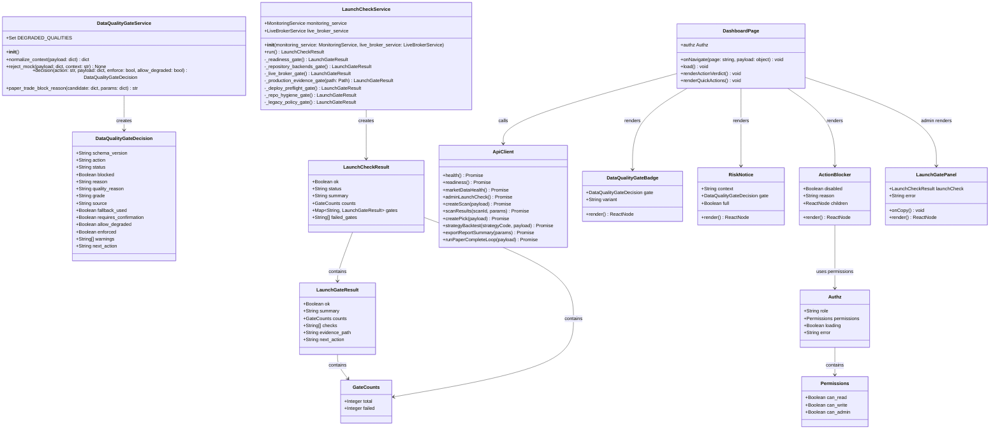
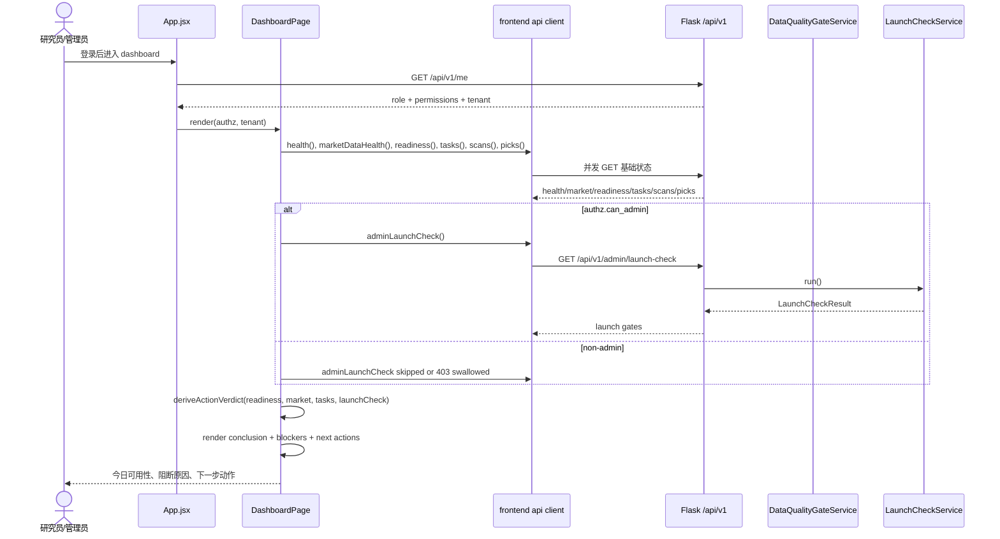
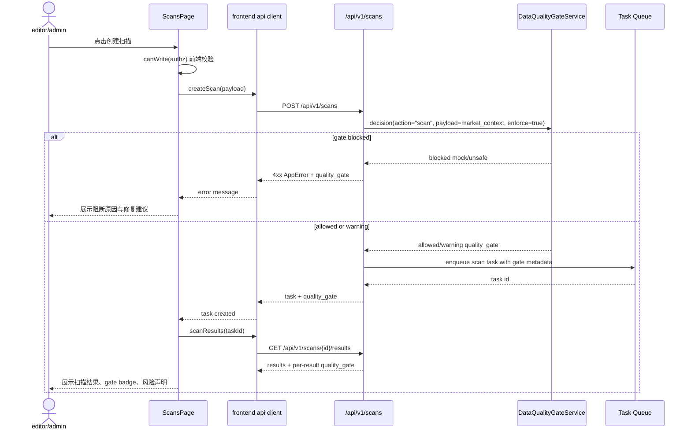
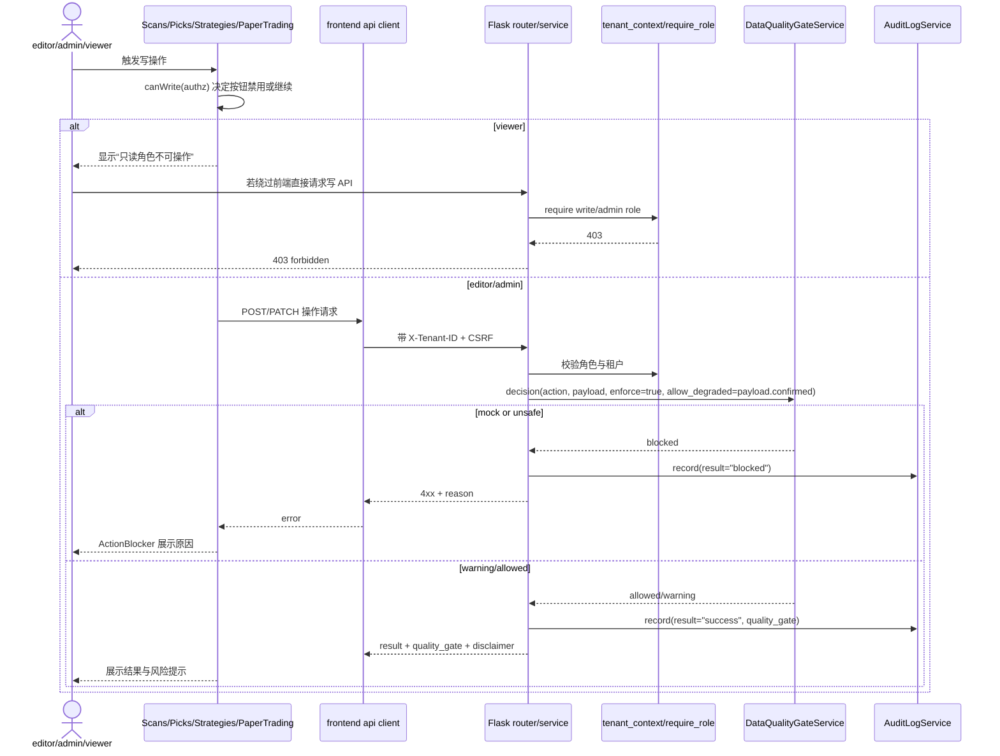
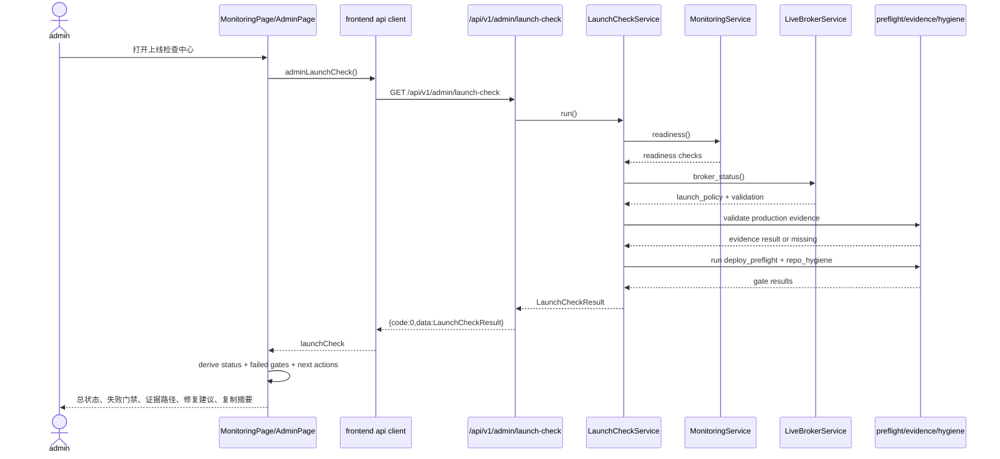
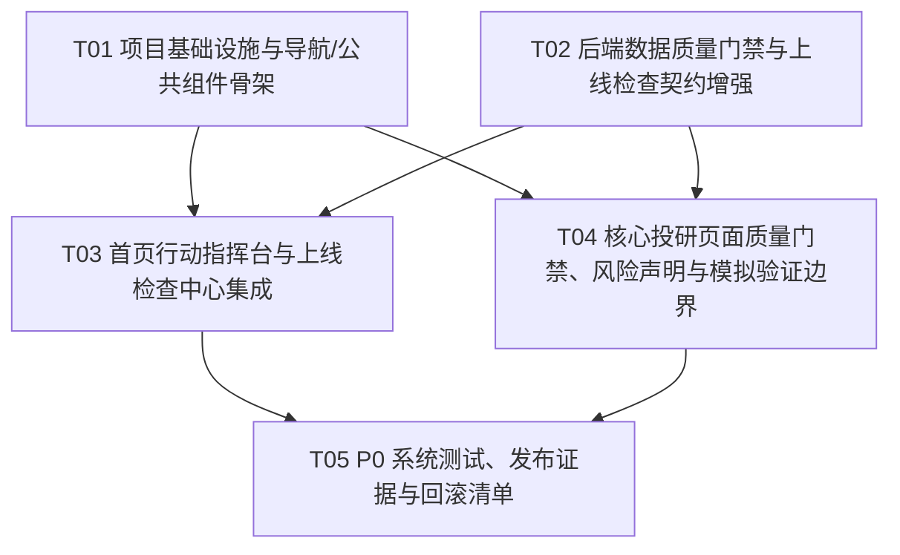

# AiStocks v1.1 P0 改造架构与实施任务计划

> 文档角色：高见远（Gao）· 架构师  
> 版本日期：2026-05-21  
> 输入依据：`aistocks-v11-incremental-prd-2026-05-21.md`、`aistocks-deep-analysis-improvement-prd-plan-2026-05-21.md` 与当前前后端关键代码  
> 范围声明：本文仅做架构设计与任务拆分，不修改业务代码；v1.1 聚焦 P0 可信闭环，不扩展实盘自动交易能力。

---

## 1. 架构目标

AiStocks v1.1 的目标是把现有“功能已存在”的投研工作台收敛为“每日可判断、异常可解释、数据可信、上线可证明”的 **可信 A 股短线投研工作台 P0 收敛版**。

### 1.1 P0 目标

1. **今日行动可判断**：首页从状态聚合升级为行动指挥台，明确今日是否可扫描、可复盘、可回测、可上线，并展示阻断原因和下一步动作。
2. **数据质量可解释**：扫描、入池、回测、报表、模拟验证统一展示 `data-quality-gate/v1` 决策结构，mock/fallback/unknown 不再静默混入正常结果。
3. **上线状态可证明**：管理员集中查看 readiness、repository backend、live broker、production evidence、deploy preflight、repo hygiene、legacy policy 等 P0 门禁。
4. **误用风险可控**：全局统一非投资建议、数据异常、回测假设、模拟验证边界与导出免责声明。
5. **权限边界可验收**：viewer 前端只读禁用、后端写接口仍返回 403；admin-only 入口普通用户不可见或不可用。
6. **信息架构收敛**：投研主线优先，“模拟交易”降级为“模拟验证”，实盘联想弱化。

### 1.2 不作为 v1.1 P0 的目标

- 不开放实盘自动交易。
- 不新增复杂外部数据源、题材/新闻/龙虎榜等增强。
- 不在本轮完成复盘中心 v1、策略生命周期 v1 的完整数据模型迁移；仅保留 P1 设计预留。
- 不大规模重构 `backend/__init__.py`、legacy 路由或 SQLite/MySQL 双轨；仅暴露风险、加强门禁与测试。

---

## 2. 最小改造原则

1. **复用现有服务，不重写主链路**  
   当前已有 `DataQualityGateService` 与 `LaunchCheckService`，v1.1 应扩展并产品化展示，而不是新建平行判断体系。

2. **前端优先统一展示组件**  
   新增/强化 `DataQualityGateBadge`、`RiskNotice`、`ActionBlocker`、`LaunchGatePanel` 等组件，减少各页面重复实现质量、风险、权限文案。

3. **后端补齐契约字段，保持 API 兼容**  
   尽量在现有返回结构中追加 `quality_gate`、`risk_disclaimer`、`launch_gate_summary` 等字段，不破坏已有字段。

4. **P0 阻断逻辑后端兜底**  
   mock 生产阻断、viewer 写拒绝、admin-only 上线检查必须由后端强校验；前端仅负责降低误操作。

5. **测试以关键路径为先**  
   优先覆盖 data quality gate、launch check、viewer 权限、首页结论、扫描/入池/回测/报表/模拟验证风险提示和导出免责声明。

6. **P1 只预留，不混入 P0 交付**  
   复盘中心、策略生命周期、报表决策视图进入 P1 文件级预留，不阻塞 v1.1 P0。

---

## 3. 目标信息架构

### 3.1 导航结构

```text
今日
  - 今日行动指挥台（dashboard）

发现与研究
  - 市场发现（discovery）
  - 策略扫描（scans）
  - 选股池（picks）
  - 股票 K 线（kline）

验证与报表
  - 策略管理 / 回测验证（strategies）
  - 研究报表（reports）
  - 模拟验证（trading，保留 route key，展示名称改为模拟验证）

系统
  - 数据中心（sync）
  - 生产监控（monitoring，admin-only 或弱化入口）
  - 上线检查（launch-check，admin-only；可落在 MonitoringPage 面板或 AdminPage 子面板）
  - 后台管理（admin，admin-only）
```

### 3.2 首页首屏结构

1. **今日结论卡**：`可正常使用 / 谨慎使用 / 不可扫描 / 不可上线`。
2. **数据空间与角色状态**：tenant id、当前角色、viewer 禁用原因。
3. **数据质量摘要**：provider、actual_provider、provider_chain、data_quality、fallback_used、quality_gate status。
4. **任务健康摘要**：failed/running/stale task 数。
5. **行动区**：创建扫描、查看选股池、运行回测、查看报表、同步行情、上线检查（admin-only）。
6. **风险声明条**：简版非投资建议 + 数据异常升级提示。
7. **管理员上线摘要**：只对 admin 展示 launch gate 总状态与失败数量。

### 3.3 关键页面 P0 改造点

| 页面 | P0 改造点 |
|---|---|
| `DashboardPage.jsx` | 首页结论算法统一、viewer 禁用动作、admin-only 上线入口、质量门禁摘要。 |
| `ScansPage.jsx` | 扫描配置与结果展示 `quality_gate`；mock 阻断；fallback/unknown 警示或确认；操作按钮用 `ActionBlocker`。 |
| `PicksPage.jsx` | 入池/复盘操作展示质量来源、fallback 状态；viewer 禁用；选股池增加 `RiskDisclaimer`。 |
| `StrategiesPage.jsx` | 回测区展示 gate、样本/coverage/基准质量，历史不代表未来提示；viewer 禁用回测/部署/生产运行。 |
| `ReportsPage.jsx` | 报表页和导出包含免责声明；数据质量分桶清晰区分 primary/fallback/mock/unknown。 |
| `PaperTradingPage.jsx` | 页面命名改“模拟验证”；强调模拟成交不代表真实成交；live broker/真实下单边界不可触发。 |
| `MonitoringPage.jsx` / `AdminPage.jsx` | 上线检查中心展示总状态、失败 gates、证据来源、建议动作；仅 admin 可见。 |

---

## 4. 后端/API 设计

### 4.1 现状复用

当前代码中已存在：

- `backend/application/data_quality_gate_service.py`
  - 已输出 `schema_version=data-quality-gate/v1`、`action`、`status`、`blocked`、`grade`、`source`、`fallback_used`、`requires_confirmation`、`warnings` 等字段。
  - 已支持 `paper_trade_block_reason()`。
- `backend/application/launch_check_service.py`
  - 已聚合 `readiness`、`repository_backends`、`live_broker_safe`、`production_evidence`、`deploy_preflight`、`repo_hygiene`、`legacy_policy_doc`。
- `backend/api_v1/routers/admin.py`
  - 已提供 `GET /api/v1/admin/launch-check`，admin-only。
- `backend/api_v1/routers/monitoring.py`
  - monitoring overview/metrics/logs/readiness 已 admin-only。

### 4.2 数据质量门禁契约

统一响应片段：

```json
{
  "quality_gate": {
    "schema_version": "data-quality-gate/v1",
    "action": "scan|pick|backtest|report|paper_trade",
    "status": "allowed|warning|blocked",
    "blocked": false,
    "grade": "primary|fallback|unknown|mock|ok",
    "source": "mootdx|akshare|mock|unknown",
    "fallback_used": false,
    "requires_confirmation": false,
    "warnings": [],
    "reason": "",
    "quality_reason": "",
    "next_action": "可继续|建议人工复核|禁止生产使用"
  }
}
```

#### 4.2.1 后端接入点

| 业务动作 | 后端位置（建议） | 门禁策略 |
|---|---|---|
| 创建扫描 | 扫描 API/service（现有 `/scans` 写入口） | 生产 mock 硬阻断；fallback/unknown 警告或需确认。 |
| 查询扫描结果 | 扫描结果返回结构 | 每条结果或结果摘要返回 `quality_gate`。 |
| 加入选股池 | pick API/service | mock 阻断；fallback/unknown 需确认或写入审计。 |
| 回测 | strategy backtest API/service | mock 阻断；样本不足/基准 fallback 强提示。 |
| 报表汇总/导出 | report API/service | fallback/mock/unknown 分桶；导出带 disclaimer。 |
| 模拟验证 | paper trading API/service | mock 阻断或强确认；确保非 live broker。 |

> 注：文档中不假设具体 service 文件名已完整阅读，工程师应在现有 routers/service 中定位对应入口并以文件级任务执行。

### 4.3 今日行动指挥台聚合 API

#### 最小方案（推荐 P0）

前端继续复用现有多个 API：

- `GET /api/v1/health`
- `GET /api/v1/market-data/health`
- `GET /api/v1/readiness`
- `GET /api/v1/scans`
- `GET /api/v1/tasks`
- `GET /api/v1/picks`
- `GET /api/v1/admin/launch-check`（admin-only，失败时前端降级）

优点：改动小、风险低、无需新增聚合 API。

#### 可选增强（P1 预留）

新增 `GET /api/v1/dashboard/action-summary`，由后端一次性聚合首页结论，减少前端重复算法。

### 4.4 上线检查 API

现有 `GET /api/v1/admin/launch-check` 可继续使用。建议补充以下展示字段，但保持兼容：

```json
{
  "ok": false,
  "status": "blocked|warning|passed|unknown",
  "summary": "launch blocked: 1 gates failed",
  "counts": {"total": 7, "failed": 1},
  "failed_gates": ["production_evidence"],
  "gates": {
    "production_evidence": {
      "ok": false,
      "summary": "production evidence file missing",
      "counts": {"total": 1, "failed": 1},
      "checks": ["production_evidence_file_present"],
      "evidence_path": ".../PRODUCTION_EVIDENCE.prod.json",
      "next_action": "补齐目标环境 production evidence 后重新执行上线检查"
    }
  }
}
```

### 4.5 权限/API 边界

- `GET /api/v1/admin/launch-check`：admin-only，editor/viewer 返回 403。
- monitoring API：保持 admin-only。
- viewer 写操作：扫描创建、入池、复盘更新、回测运行、模拟验证触发、用户管理、live broker 尝试均返回 403。
- 跨租户访问：所有写/读敏感资源必须校验 `X-Tenant-ID` 与登录绑定租户。
- 审计：写操作记录 user、tenant、action、resource、result；viewer 写拒绝可记录安全审计或至少测试覆盖。

---

## 5. 前端组件设计

### 5.1 新增/强化公共组件

| 组件 | 文件 | 责任 |
|---|---|---|
| `DataQualityGateBadge` | `frontend/src/components/common/DataQualityGateBadge.jsx` | 展示 allowed/warning/blocked、grade/source/fallback/requires_confirmation。 |
| `RiskNotice` | `frontend/src/components/common/RiskNotice.jsx` | 统一非投资建议文案；支持 scan/backtest/report/paper/kline/dashboard 场景。 |
| `ActionBlocker` | `frontend/src/components/common/ActionBlocker.jsx` | 包装按钮禁用原因：viewer、mock、fallback 需确认、admin-only、live broker disabled。 |
| `LaunchGatePanel` | `frontend/src/components/common/LaunchGatePanel.jsx` | 展示上线检查总状态、失败 gates、counts、summary、next_action、复制摘要。 |
| `RiskDisclaimer` | `frontend/src/components/common/RiskDisclaimer.jsx` | 现有组件升级文案：v1.1、模拟验证、历史不代表未来、数据可能延迟/降级。 |
| `components/common/index.js` | `frontend/src/components/common/index.js` | 导出新增组件。 |

### 5.2 页面集成

| 页面文件 | 集成要求 |
|---|---|
| `frontend/src/app/App.jsx` | 调整 `pageMeta` 和 `navGroups`；保留 route key `trading`，展示名改“模拟验证”；admin-only 项可通过 `authz` 过滤或禁用。 |
| `frontend/src/pages/DashboardPage.jsx` | 首页结论独立为纯函数；加入 admin launch 摘要；行动区使用 `ActionBlocker`；展示 `DataQualityGateBadge`。 |
| `frontend/src/pages/ScansPage.jsx` | 扫描表单和结果区展示 `DataQualityGateBadge`；操作按钮根据 gate 和 viewer 权限禁用。 |
| `frontend/src/pages/PicksPage.jsx` | 增加 `RiskNotice`/`RiskDisclaimer`；候选行展示质量 gate；复盘保存按钮使用 `ActionBlocker`。 |
| `frontend/src/pages/StrategiesPage.jsx` | 回测结果展示 gate、样本量、coverage、benchmark quality；回测按钮 viewer 禁用。 |
| `frontend/src/pages/ReportsPage.jsx` | 页面与导出提示统一免责声明；数据质量分桶可视化。 |
| `frontend/src/pages/PaperTradingPage.jsx` | 标题、文案、按钮文案从“模拟交易”改“模拟验证”；强化非实盘边界。 |
| `frontend/src/pages/MonitoringPage.jsx` | 使用 `LaunchGatePanel` 替换当前简版上线检查列表。 |
| `frontend/src/pages/AdminPage.jsx` | 增加上线检查入口或卡片，避免管理员在监控页外找不到 P0 门禁。 |

### 5.3 前端纯函数建议

建议将首页结论和质量门禁文案抽成纯函数，便于单测与页面复用：

- `frontend/src/utils/actionVerdict.js`
  - `deriveActionVerdict({ readiness, market, tasks, launchCheck })`
  - `qualityGateTone(gate)`
  - `qualityGateText(gate)`
- `frontend/src/utils/launchGate.js`
  - `deriveLaunchStatus(launchCheck)`
  - `launchGateNextAction(gateName, gate)`

---

## 6. 文件修改清单

### 6.1 前端文件

```text
frontend/src/app/App.jsx
frontend/src/api/client.js
frontend/src/auth/permissions.js
frontend/src/components/common/index.js
frontend/src/components/common/RiskDisclaimer.jsx
frontend/src/components/common/DataQualityGateBadge.jsx
frontend/src/components/common/RiskNotice.jsx
frontend/src/components/common/ActionBlocker.jsx
frontend/src/components/common/LaunchGatePanel.jsx
frontend/src/pages/DashboardPage.jsx
frontend/src/pages/ScansPage.jsx
frontend/src/pages/PicksPage.jsx
frontend/src/pages/StrategiesPage.jsx
frontend/src/pages/ReportsPage.jsx
frontend/src/pages/PaperTradingPage.jsx
frontend/src/pages/MonitoringPage.jsx
frontend/src/pages/AdminPage.jsx
frontend/src/styles/main.css
frontend/e2e/auth.spec.js
frontend/e2e/admin.spec.js
frontend/e2e/permissions.spec.js
frontend/e2e/scans.spec.js
frontend/e2e/reports.spec.js
frontend/e2e/paper-trading.spec.js
frontend/e2e/workflow-closure.spec.js
```

### 6.2 后端文件

```text
backend/application/data_quality_gate_service.py
backend/application/launch_check_service.py
backend/api_v1/routers/admin.py
backend/api_v1/routers/monitoring.py
# 需由工程师定位并修改的现有业务入口：
backend/api_v1/routers/scans.py
backend/api_v1/routers/picks.py
backend/api_v1/routers/strategies.py
backend/api_v1/routers/reports.py
backend/api_v1/routers/trading.py
# 对应 service/repository 文件按实际代码引用补充 gate 字段和阻断逻辑
```

### 6.3 测试文件

```text
tests/test_data_quality_gate_service.py
tests/test_launch_check_service.py
tests/test_api_v1.py
tests/test_api_v1_e2e.py
tests/test_pick_api_service.py
tests/test_report_api_service.py
tests/test_live_broker_service.py
tests/test_tenant_repository.py
frontend/e2e/permissions.spec.js
frontend/e2e/scans.spec.js
frontend/e2e/reports.spec.js
frontend/e2e/paper-trading.spec.js
frontend/e2e/admin.spec.js
frontend/e2e/workflow-closure.spec.js
```

### 6.4 文档/证据文件

```text
docs/software-company/aistocks-v11-incremental-prd-2026-05-21.md
docs/software-company/aistocks-v11-architecture-plan-2026-05-21.md
docs/product/LEGACY_ADMIN_POLICY.md
PRODUCTION_EVIDENCE.prod.json 或目标环境 evidence 文件
```

---

## 7. 数据结构与接口（Mermaid classDiagram）



---

## 8. 数据流/调用流（Mermaid sequenceDiagram）

### 8.1 首页行动指挥台初始化



### 8.2 扫描创建与质量门禁



### 8.3 加入选股池/回测/模拟验证的统一门禁



### 8.4 管理员上线检查中心



---

## 9. 实施任务列表（不超过 5 个，按依赖排序）

### T01：项目基础设施与导航/公共组件骨架

- **优先级**：P0
- **依赖**：无
- **目标**：建立 v1.1 前端公共展示基础，调整信息架构，确保后续页面能复用统一质量、风险、阻断、上线面板组件。
- **源文件**：
  - `frontend/src/app/App.jsx`
  - `frontend/src/api/client.js`
  - `frontend/src/components/common/index.js`
  - `frontend/src/components/common/RiskDisclaimer.jsx`
  - `frontend/src/components/common/DataQualityGateBadge.jsx`
  - `frontend/src/components/common/RiskNotice.jsx`
  - `frontend/src/components/common/ActionBlocker.jsx`
  - `frontend/src/components/common/LaunchGatePanel.jsx`
  - `frontend/src/styles/main.css`
- **实施要点**：
  1. `App.jsx` 重排 `navGroups`，将 `Trading` 首组移除，`trading` 展示名改为“模拟验证”。
  2. 新增公共组件并在 `index.js` 导出。
  3. `RiskDisclaimer` 升级为 v1.1 文案，支持 compact/full 和上下文风险升级。
  4. `LaunchGatePanel` 只展示脱敏 summary/counts/checks/evidence path，不展示 token/密码/连接串。
- **验收**：前端构建通过；导航顺序符合 PRD；公共组件可被后续页面引用。

### T02：后端数据质量门禁与上线检查契约增强

- **优先级**：P0
- **依赖**：T01 可并行部分开发，但建议先明确公共字段。
- **目标**：扩展现有后端服务的 P0 契约字段，保证 mock/fallback/unknown/launch gate 规则在后端有统一来源。
- **源文件**：
  - `backend/application/data_quality_gate_service.py`
  - `backend/application/launch_check_service.py`
  - `backend/api_v1/routers/admin.py`
  - `backend/api_v1/routers/monitoring.py`
  - `backend/api_v1/routers/scans.py`（按实际存在路径）
  - `backend/api_v1/routers/picks.py`（按实际存在路径）
  - `backend/api_v1/routers/strategies.py`（按实际存在路径）
  - `backend/api_v1/routers/reports.py`（按实际存在路径）
  - `backend/api_v1/routers/trading.py`（按实际存在路径）
  - `tests/test_data_quality_gate_service.py`
  - `tests/test_launch_check_service.py`
- **实施要点**：
  1. `DataQualityGateService.decision()` 增加/规范 `next_action`、`display_message`（如需要）并保持既有测试字段兼容。
  2. scan/pick/backtest/report/paper_trade 写或结果接口统一追加 `quality_gate`。
  3. mock 在 enforce 场景硬阻断；fallback/unknown 默认 warning + requires_confirmation，允许继续时需显式 `allow_degraded` 或确认字段。
  4. `LaunchCheckService.run()` 输出 `status=passed|warning|blocked|unknown`、gate-level `next_action` 与 evidence path（仅路径，不含敏感配置）。
  5. admin-only 路由保持 403，不把上线检查暴露给 editor/viewer。
- **验收**：后端 gate 单测通过；admin launch check 结构包含 7 类 gates；mock/fallback 决策符合 PRD。

### T03：首页行动指挥台与上线检查中心集成

- **优先级**：P0
- **依赖**：T01、T02
- **目标**：让用户进入首页即可判断今日可用性；让 admin 能集中查看上线门禁。
- **源文件**：
  - `frontend/src/pages/DashboardPage.jsx`
  - `frontend/src/pages/MonitoringPage.jsx`
  - `frontend/src/pages/AdminPage.jsx`
  - `frontend/src/components/common/LaunchGatePanel.jsx`
  - `frontend/src/components/common/DataQualityGateBadge.jsx`
  - `frontend/src/components/common/ActionBlocker.jsx`
  - `frontend/src/api/client.js`
  - `frontend/e2e/admin.spec.js`
  - `frontend/e2e/permissions.spec.js`
  - `frontend/e2e/workflow-closure.spec.js`
- **实施要点**：
  1. `DashboardPage` 计算并展示 `可正常使用 / 谨慎使用 / 不可扫描 / 不可上线`，文字说明不可只靠颜色。
  2. 首页行动按钮根据 `authz`、质量门禁、readiness 禁用或提示；viewer 不显示可写快捷动作或显示禁用原因。
  3. admin 才调用/展示 launch check；editor/viewer 不显示入口，或访问后前端展示权限不足。
  4. `MonitoringPage` 用 `LaunchGatePanel` 展示所有 gates、失败数量、summary、next_action、复制摘要。
  5. `AdminPage` 增加上线检查卡片或跳转入口。
- **验收**：E2E 可验证首页结论、viewer 禁用、admin 上线检查入口与失败门禁展示。

### T04：核心投研页面质量门禁、风险声明与模拟验证边界

- **优先级**：P0
- **依赖**：T01、T02
- **目标**：扫描、入池、回测、报表、模拟验证统一展示数据质量和非投资建议；mock/fallback/unknown 不再静默作为正常数据使用。
- **源文件**：
  - `frontend/src/pages/ScansPage.jsx`
  - `frontend/src/pages/PicksPage.jsx`
  - `frontend/src/pages/StrategiesPage.jsx`
  - `frontend/src/pages/ReportsPage.jsx`
  - `frontend/src/pages/PaperTradingPage.jsx`
  - `frontend/src/components/common/DataQualityGateBadge.jsx`
  - `frontend/src/components/common/RiskNotice.jsx`
  - `frontend/src/components/common/ActionBlocker.jsx`
  - `frontend/src/components/common/RiskDisclaimer.jsx`
  - `tests/test_pick_api_service.py`
  - `tests/test_report_api_service.py`
  - `tests/test_live_broker_service.py`
  - `frontend/e2e/scans.spec.js`
  - `frontend/e2e/reports.spec.js`
  - `frontend/e2e/paper-trading.spec.js`
- **实施要点**：
  1. `ScansPage`：扫描结果、加入池、模拟买入按钮展示 gate 和阻断原因；fallback/unknown 文案升级。
  2. `PicksPage`：增加风险声明；候选列表用 gate badge 或质量来源摘要；复盘/批量操作遵循 viewer 禁用。
  3. `StrategiesPage`：回测结果增加历史不代表未来、样本量、数据质量、benchmark/fallback 提示。
  4. `ReportsPage`：页面和导出路径保证 disclaimer；质量分桶 primary/fallback/mock/unknown 清晰。
  5. `PaperTradingPage`：标题与文案改“模拟验证”；按钮说明“模拟成交不代表真实成交”；真实 live broker 不可见/不可触发。
- **验收**：关键页面均出现“非投资建议”或等价中文声明；mock/fallback/unknown 状态可见；viewer 写操作禁用且后端仍 403。

### T05：P0 系统测试、发布证据与回滚清单

- **优先级**：P0（P1 预留项只记录，不阻塞）
- **依赖**：T02、T03、T04
- **目标**：补齐可重复验证命令、E2E smoke、security smoke、production evidence 与回滚方案。
- **源文件**：
  - `tests/test_api_v1.py`
  - `tests/test_api_v1_e2e.py`
  - `tests/test_tenant_repository.py`
  - `tests/test_deploy_preflight.py`
  - `tests/test_production_evidence.py`
  - `tests/test_task_queue.py`
  - `frontend/e2e/auth.spec.js`
  - `frontend/e2e/admin.spec.js`
  - `frontend/e2e/permissions.spec.js`
  - `frontend/e2e/scans.spec.js`
  - `frontend/e2e/reports.spec.js`
  - `frontend/e2e/paper-trading.spec.js`
  - `frontend/e2e/workflow-closure.spec.js`
  - `docs/software-company/aistocks-v11-architecture-plan-2026-05-21.md`
- **实施要点**：
  1. 增加/调整 E2E smoke：登录、首页、扫描、viewer 权限、上线检查入口、报表/模拟验证风险声明。
  2. 后端补充 API/security smoke：CSRF、CORS、Cookie、安全头、租户越权、viewer 写拒绝。
  3. 运行并记录关键命令：后端关键 pytest、前端 build、Playwright smoke、deploy preflight、repo hygiene、production evidence。
  4. 形成 release notes、已知风险、回滚步骤与证据路径。
- **验收**：P0 自动化/手工验收清单完整；production evidence 缺失时必须显示不可上线或内部试运行阻断。

---

## 10. 任务依赖图



---

## 11. Required Packages

当前仓库已具备主要技术栈，v1.1 P0 不建议新增运行时依赖。

```text
- React 19 / Vite 8：现有前端框架与构建工具，继续使用。
- Playwright：现有 E2E 测试框架，补充 smoke 覆盖。
- Flask 3：现有后端 API 框架，继续使用 /api/v1。
- SQLAlchemy 2 / Alembic：现有数据访问和迁移能力，P0 不新增迁移为主。
- pytest：现有后端测试框架。
- Redis：现有 task queue/cache，P0 只展示健康与门禁，不更换队列框架。
```

如必须新增前端状态/工具库，需先评估；P0 默认不引入 MUI/Tailwind 等新 UI 栈，避免扩大改造面。

---

## 12. 测试计划

### 12.1 后端关键测试

建议优先运行：

```powershell
C:/Users/amir/AppData/Local/Programs/Python/Python312/python.exe -m pytest tests/test_data_quality_gate_service.py tests/test_launch_check_service.py tests/test_production_evidence.py tests/test_deploy_preflight.py tests/test_task_queue.py -q
```

扩展 P0 API/security：

```powershell
C:/Users/amir/AppData/Local/Programs/Python/Python312/python.exe -m pytest tests/test_api_v1.py tests/test_api_v1_e2e.py tests/test_pick_api_service.py tests/test_report_api_service.py tests/test_live_broker_service.py tests/test_tenant_repository.py -q
```

### 12.2 前端构建与 E2E

```powershell
npm --prefix D:/AiStocks/frontend run build
npm --prefix D:/AiStocks/frontend run test:e2e -- admin.spec.js permissions.spec.js scans.spec.js reports.spec.js paper-trading.spec.js workflow-closure.spec.js
```

如项目未配置按文件筛选脚本，则使用仓库现有 Playwright 命令运行全部 E2E。

### 12.3 运维/上线门禁

```powershell
C:/Users/amir/AppData/Local/Programs/Python/Python312/python.exe scripts/deploy_preflight.py
C:/Users/amir/AppData/Local/Programs/Python/Python312/python.exe scripts/check_repo_hygiene.py
# production evidence 按目标环境 runbook 采集并验证
```

### 12.4 P0 验收用例

| 用例 | 覆盖点 | 预期 |
|---|---|---|
| ST-01 首页 readiness failed | 今日行动指挥台 | 显示“不可上线”或等价危险状态。 |
| ST-02 生产 mock provider | 数据质量门禁 | 首页不可扫描；扫描/回测/模拟验证被阻断。 |
| ST-03 fallback/unknown | 数据质量门禁 | 显示“谨慎使用”，关键动作需确认或提示。 |
| ST-04 viewer 写操作 | 权限 | 前端禁用并说明原因；后端请求返回 403。 |
| ST-05 admin 上线检查 | LaunchCheck | 展示 7 类 gates、失败数量、证据路径、建议动作。 |
| ST-06 live broker disabled | 安全边界 | 页面展示不可实盘；真实下单入口不可触发。 |
| ST-07 报表导出 | 风险声明 | 导出内容包含 disclaimer 或说明区。 |
| ST-08 跨租户访问 | 租户隔离 | 非绑定租户资源访问返回 403。 |

---

## 13. 风险与回滚方案

### 13.1 主要风险

| 风险 | 影响 | 缓解 |
|---|---|---|
| 前端多页面同时接入公共组件导致构建回归 | 页面不可用 | T01 先落公共组件最小 API；每接入一页立即 build。 |
| 后端新增 `quality_gate` 字段影响已有调用方 | API 兼容问题 | 只追加字段，不删除旧字段；保持 `DataQualityGateService` 既有测试契约。 |
| `LaunchCheckService` 调用 preflight/repo hygiene 较慢 | 页面加载慢 | 前端允许 loading/刷新；P1 可增加缓存；P0 可保留手动刷新。 |
| admin-only 导航过滤导致页面路由不可达 | 运维入口缺失 | dashboard admin 卡片 + system nav 双入口；非 admin 隐藏或显示权限不足。 |
| fallback/unknown 二次确认规则不一致 | 用户困惑/误阻断 | 统一由 `DataQualityGateService.decision()` 输出 `requires_confirmation`；页面只渲染。 |
| production evidence 缺失 | 无法显示可上线 | 按 PRD 显示“不可上线/内部试运行待补证据”，不强行通过。 |

### 13.2 回滚策略

1. **前端导航/组件回滚**：
   - 保留 route key 不变（尤其 `trading`），仅改显示文案和组件引用，出现问题时可回退 `App.jsx` 与页面组件引用。
2. **后端契约回滚**：
   - 仅追加 `quality_gate`/`next_action` 字段；若异常，可临时不消费新字段，旧字段保持可用。
3. **上线检查面板回滚**：
   - `adminLaunchCheck()` 已是独立 API；前端面板失败时降级显示“上线检查暂不可用”，不影响普通投研读路径。
4. **阻断规则回滚**：
   - mock 生产阻断不可回滚；fallback/unknown 的继续策略可通过 `allow_degraded`/确认参数临时放宽，但必须展示 warning 并记录审计。
5. **发布回滚**：
   - 若 build/E2E/preflight 任一 P0 失败，不发布 v1.1；保留当前稳定分支/镜像，恢复上一版本前端静态资源和后端服务镜像。

---

## 14. Shared Knowledge（工程师共识）

- 所有 `/api/v1` 响应仍遵循 `{code, data, message}` 包装。
- 所有非 GET/HEAD/OPTIONS 请求继续携带 CSRF token 与 `X-Tenant-ID`。
- viewer 前端禁用只是体验优化，后端必须返回 403。
- admin-only 页面和 API 不得向 editor/viewer 泄露 production evidence 细节、密钥、token、数据库密码。
- 所有投研输出必须使用“研究线索 / 候选 / 验证结果”，不得表达为“买入/卖出建议”。
- 报表导出必须保留免责声明，避免脱离系统上下文后被误用。
- `trading` route key 可保留以避免路由破坏，但 UI 名称统一改“模拟验证”。
- live broker 在 v1.1 必须 disabled/dry-run，不开放真实下单。
- production evidence 缺失时，不允许显示“满足正式上线条件”。
- P1 复盘中心/策略生命周期只预留，不阻塞 P0。

---

## 15. Anything UNCLEAR（待确认与默认假设）

1. **上线检查入口位置**：默认采用 `MonitoringPage` 主面板 + `AdminPage` 卡片入口，不新增独立 route；如产品坚持独立页面，可在 P1 拆分。
2. **fallback/unknown 是否允许继续**：默认扫描/回测可警告继续，入池/模拟验证需确认；mock 生产硬阻断。
3. **production evidence 目标环境**：默认以目标部署环境采集文件为准；本地 PASS 不等于 production PASS。
4. **导出免责声明形式**：默认 JSON 增加 `disclaimer` 字段，CSV 增加顶部或底部说明行；若现有导出格式不便插入，则至少文件名/metadata/说明 section 保留。
5. **admin-only 导航策略**：默认普通用户隐藏 admin-only 项；若为培训需要，可显示但禁用并提示权限不足。
6. **完整 Playwright 范围**：P0 至少 smoke；完整回归可作为发布前增强，但不应阻塞编码阶段逐步提交。
